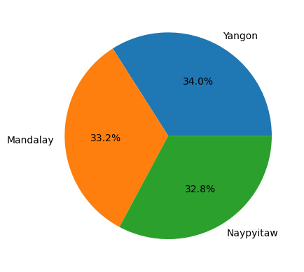

```python
import pandas as pd
```


```python
super_market=pd.read_csv('/Users/jishnu.suneesh/downloads/supermarket_sales.csv')
```


```python
super_market.describe()
```


<div>
<style scoped>
    .dataframe tbody tr th:only-of-type {
        vertical-align: middle;
    }

    .dataframe tbody tr th {
        vertical-align: top;
    }

    .dataframe thead th {
        text-align: right;
    }
</style>
<table border="1" class="dataframe">
  <thead>
    <tr style="text-align: right;">
      <th></th>
      <th>Unit price</th>
      <th>Quantity</th>
      <th>Tax 5%</th>
      <th>Total</th>
      <th>cogs</th>
      <th>gross margin percentage</th>
      <th>gross income</th>
      <th>Rating</th>
    </tr>
  </thead>
  <tbody>
    <tr>
      <th>count</th>
      <td>1000.000000</td>
      <td>1000.000000</td>
      <td>1000.000000</td>
      <td>1000.000000</td>
      <td>1000.00000</td>
      <td>1.000000e+03</td>
      <td>1000.000000</td>
      <td>1000.00000</td>
    </tr>
    <tr>
      <th>mean</th>
      <td>55.672130</td>
      <td>5.510000</td>
      <td>15.379369</td>
      <td>322.966749</td>
      <td>307.58738</td>
      <td>4.761905e+00</td>
      <td>15.379369</td>
      <td>6.97270</td>
    </tr>
    <tr>
      <th>std</th>
      <td>26.494628</td>
      <td>2.923431</td>
      <td>11.708825</td>
      <td>245.885335</td>
      <td>234.17651</td>
      <td>6.131498e-14</td>
      <td>11.708825</td>
      <td>1.71858</td>
    </tr>
    <tr>
      <th>min</th>
      <td>10.080000</td>
      <td>1.000000</td>
      <td>0.508500</td>
      <td>10.678500</td>
      <td>10.17000</td>
      <td>4.761905e+00</td>
      <td>0.508500</td>
      <td>4.00000</td>
    </tr>
    <tr>
      <th>25%</th>
      <td>32.875000</td>
      <td>3.000000</td>
      <td>5.924875</td>
      <td>124.422375</td>
      <td>118.49750</td>
      <td>4.761905e+00</td>
      <td>5.924875</td>
      <td>5.50000</td>
    </tr>
    <tr>
      <th>50%</th>
      <td>55.230000</td>
      <td>5.000000</td>
      <td>12.088000</td>
      <td>253.848000</td>
      <td>241.76000</td>
      <td>4.761905e+00</td>
      <td>12.088000</td>
      <td>7.00000</td>
    </tr>
    <tr>
      <th>75%</th>
      <td>77.935000</td>
      <td>8.000000</td>
      <td>22.445250</td>
      <td>471.350250</td>
      <td>448.90500</td>
      <td>4.761905e+00</td>
      <td>22.445250</td>
      <td>8.50000</td>
    </tr>
    <tr>
      <th>max</th>
      <td>99.960000</td>
      <td>10.000000</td>
      <td>49.650000</td>
      <td>1042.650000</td>
      <td>993.00000</td>
      <td>4.761905e+00</td>
      <td>49.650000</td>
      <td>10.00000</td>
    </tr>
  </tbody>
</table>
</div>


```python
super_market.isna().sum()
```


    Invoice ID                 0
    Branch                     0
    City                       0
    Customer type              0
    Gender                     0
    Product line               0
    Unit price                 0
    Quantity                   0
    Tax 5%                     0
    Total                      0
    Date                       0
    Time                       0
    Payment                    0
    cogs                       0
    gross margin percentage    0
    gross income               0
    Rating                     0
    dtype: int64


```python
super_market.duplicated().sum()
```


    0


```python
super_market.info()
```

    <class 'pandas.core.frame.DataFrame'>
    RangeIndex: 1000 entries, 0 to 999
    Data columns (total 17 columns):
     #   Column                   Non-Null Count  Dtype  
    ---  ------                   --------------  -----  
     0   Invoice ID               1000 non-null   object 
     1   Branch                   1000 non-null   object 
     2   City                     1000 non-null   object 
     3   Customer type            1000 non-null   object 
     4   Gender                   1000 non-null   object 
     5   Product line             1000 non-null   object 
     6   Unit price               1000 non-null   float64
     7   Quantity                 1000 non-null   int64  
     8   Tax 5%                   1000 non-null   float64
     9   Total                    1000 non-null   float64
     10  Date                     1000 non-null   object 
     11  Time                     1000 non-null   object 
     12  Payment                  1000 non-null   object 
     13  cogs                     1000 non-null   float64
     14  gross margin percentage  1000 non-null   float64
     15  gross income             1000 non-null   float64
     16  Rating                   1000 non-null   float64
    dtypes: float64(7), int64(1), object(9)
    memory usage: 132.9+ KB


```python
super_market.rename(columns={'Invoice ID':'Invoice_ID','Customer type':'Customer_type','Product line':'Product_line',
                            'Unit price':'Unit_price','Tax 5%':'Tax_5%','gross margin percentage':'gross_margin_percentage',
                            'gross income':'gross_income'},inplace=True)
super_market.info()
```

    <class 'pandas.core.frame.DataFrame'>
    RangeIndex: 1000 entries, 0 to 999
    Data columns (total 17 columns):
     #   Column                   Non-Null Count  Dtype  
    ---  ------                   --------------  -----  
     0   Invoice_ID               1000 non-null   object 
     1   Branch                   1000 non-null   object 
     2   City                     1000 non-null   object 
     3   Customer_type            1000 non-null   object 
     4   Gender                   1000 non-null   object 
     5   Product_line             1000 non-null   object 
     6   Unit_price               1000 non-null   float64
     7   Quantity                 1000 non-null   int64  
     8   Tax_5%                   1000 non-null   float64
     9   Total                    1000 non-null   float64
     10  Date                     1000 non-null   object 
     11  Time                     1000 non-null   object 
     12  Payment                  1000 non-null   object 
     13  cogs                     1000 non-null   float64
     14  gross_margin_percentage  1000 non-null   float64
     15  gross_income             1000 non-null   float64
     16  Rating                   1000 non-null   float64
    dtypes: float64(7), int64(1), object(9)
    memory usage: 132.9+ KB


```python
super_market.head()
```


<div>
<style scoped>
    .dataframe tbody tr th:only-of-type {
        vertical-align: middle;
    }

    .dataframe tbody tr th {
        vertical-align: top;
    }

    .dataframe thead th {
        text-align: right;
    }
</style>
<table border="1" class="dataframe">
  <thead>
    <tr style="text-align: right;">
      <th></th>
      <th>Invoice_ID</th>
      <th>Branch</th>
      <th>City</th>
      <th>Customer_type</th>
      <th>Gender</th>
      <th>Product_line</th>
      <th>Unit_price</th>
      <th>Quantity</th>
      <th>Tax_5%</th>
      <th>Total</th>
      <th>Date</th>
      <th>Time</th>
      <th>Payment</th>
      <th>cogs</th>
      <th>gross_margin_percentage</th>
      <th>gross_income</th>
      <th>Rating</th>
    </tr>
  </thead>
  <tbody>
    <tr>
      <th>0</th>
      <td>750-67-8428</td>
      <td>A</td>
      <td>Yangon</td>
      <td>Member</td>
      <td>Female</td>
      <td>Health and beauty</td>
      <td>74.69</td>
      <td>7</td>
      <td>26.1415</td>
      <td>548.9715</td>
      <td>01/05/19</td>
      <td>13:08</td>
      <td>Ewallet</td>
      <td>522.83</td>
      <td>4.761905</td>
      <td>26.1415</td>
      <td>9.1</td>
    </tr>
    <tr>
      <th>1</th>
      <td>226-31-3081</td>
      <td>C</td>
      <td>Naypyitaw</td>
      <td>Normal</td>
      <td>Female</td>
      <td>Electronic accessories</td>
      <td>15.28</td>
      <td>5</td>
      <td>3.8200</td>
      <td>80.2200</td>
      <td>03/08/19</td>
      <td>10:29</td>
      <td>Cash</td>
      <td>76.40</td>
      <td>4.761905</td>
      <td>3.8200</td>
      <td>9.6</td>
    </tr>
    <tr>
      <th>2</th>
      <td>631-41-3108</td>
      <td>A</td>
      <td>Yangon</td>
      <td>Normal</td>
      <td>Male</td>
      <td>Home and lifestyle</td>
      <td>46.33</td>
      <td>7</td>
      <td>16.2155</td>
      <td>340.5255</td>
      <td>03/03/19</td>
      <td>13:23</td>
      <td>Credit card</td>
      <td>324.31</td>
      <td>4.761905</td>
      <td>16.2155</td>
      <td>7.4</td>
    </tr>
    <tr>
      <th>3</th>
      <td>123-19-1176</td>
      <td>A</td>
      <td>Yangon</td>
      <td>Member</td>
      <td>Male</td>
      <td>Health and beauty</td>
      <td>58.22</td>
      <td>8</td>
      <td>23.2880</td>
      <td>489.0480</td>
      <td>1/27/2019</td>
      <td>20:33</td>
      <td>Ewallet</td>
      <td>465.76</td>
      <td>4.761905</td>
      <td>23.2880</td>
      <td>8.4</td>
    </tr>
    <tr>
      <th>4</th>
      <td>373-73-7910</td>
      <td>A</td>
      <td>Yangon</td>
      <td>Normal</td>
      <td>Male</td>
      <td>Sports and travel</td>
      <td>86.31</td>
      <td>7</td>
      <td>30.2085</td>
      <td>634.3785</td>
      <td>02/08/19</td>
      <td>10:37</td>
      <td>Ewallet</td>
      <td>604.17</td>
      <td>4.761905</td>
      <td>30.2085</td>
      <td>5.3</td>
    </tr>
  </tbody>
</table>
</div>


```python
super_market['Date']=pd.to_datetime(super_market['Date'])
super_market['Time']=pd.to_datetime(super_market['Time']).dt.time

super_market['Date'].dt.month.unique()
super_market['Date'].dt.day.unique()
```

    /var/folders/z_/5gwy872d0cj04k39nqbc17jw0000gq/T/ipykernel_98082/1776681647.py:1: UserWarning: Could not infer format, so each element will be parsed individually, falling back to `dateutil`. To ensure parsing is consistent and as-expected, please specify a format.
      super_market['Date']=pd.to_datetime(super_market['Date'])
    /var/folders/z_/5gwy872d0cj04k39nqbc17jw0000gq/T/ipykernel_98082/1776681647.py:2: UserWarning: Could not infer format, so each element will be parsed individually, falling back to `dateutil`. To ensure parsing is consistent and as-expected, please specify a format.
      super_market['Time']=pd.to_datetime(super_market['Time']).dt.time


    array([ 5,  8,  3, 27, 25, 24, 10, 20,  6,  9, 12,  7, 29, 15, 11,  1, 21,
           17,  2, 22, 28, 23,  4, 16, 19, 14, 13, 26, 18, 30, 31],
          dtype=int32)


```python
super_market['Date'].max()
```


    Timestamp('2019-03-30 00:00:00')


```python
import seaborn as sns
import matplotlib.pyplot as plt

data_1=super_market[super_market['Date'].dt.month==1]
data_2=super_market[super_market['Date'].dt.month==2]
data_3=super_market[super_market['Date'].dt.month==3]

plt.figure(figsize=(12,7),facecolor='lightyellow')

plt.subplot(3,1,1)
sns.lineplot(x=data_1['Date'].dt.day,y=data_1['gross_income'],color='g')
plt.title("Gorss Income On Jan")
plt.grid(color='black',ls='--',lw=0.5)
plt.xlabel('Day in month')


plt.subplot(3,1,2)
sns.lineplot(x=data_2['Date'].dt.day,y=data_2['gross_income'],color='r')
plt.title("Gorss Income On Feb")
plt.grid(color='black',ls='--',lw=0.5)
plt.xlabel('Day in month')

plt.subplot(3,1,3)
sns.lineplot(x=data_3['Date'].dt.day,y=data_3['gross_income'],color='b')
plt.title("Gorss Income On Mar")
plt.grid(color='black',ls='--',lw=0.5)
plt.xlabel('Day in month')


plt.subplots_adjust(hspace=0.7)
plt.show()
```


    

    


```python
super_market.head()
```


<div>
<style scoped>
    .dataframe tbody tr th:only-of-type {
        vertical-align: middle;
    }

    .dataframe tbody tr th {
        vertical-align: top;
    }

    .dataframe thead th {
        text-align: right;
    }
</style>
<table border="1" class="dataframe">
  <thead>
    <tr style="text-align: right;">
      <th></th>
      <th>Invoice_ID</th>
      <th>Branch</th>
      <th>City</th>
      <th>Customer_type</th>
      <th>Gender</th>
      <th>Product_line</th>
      <th>Unit_price</th>
      <th>Quantity</th>
      <th>Tax_5%</th>
      <th>Total</th>
      <th>Date</th>
      <th>Time</th>
      <th>Payment</th>
      <th>cogs</th>
      <th>gross_margin_percentage</th>
      <th>gross_income</th>
      <th>Rating</th>
    </tr>
  </thead>
  <tbody>
    <tr>
      <th>0</th>
      <td>750-67-8428</td>
      <td>A</td>
      <td>Yangon</td>
      <td>Member</td>
      <td>Female</td>
      <td>Health and beauty</td>
      <td>74.69</td>
      <td>7</td>
      <td>26.1415</td>
      <td>548.9715</td>
      <td>2019-01-05</td>
      <td>13:08:00</td>
      <td>Ewallet</td>
      <td>522.83</td>
      <td>4.761905</td>
      <td>26.1415</td>
      <td>9.1</td>
    </tr>
    <tr>
      <th>1</th>
      <td>226-31-3081</td>
      <td>C</td>
      <td>Naypyitaw</td>
      <td>Normal</td>
      <td>Female</td>
      <td>Electronic accessories</td>
      <td>15.28</td>
      <td>5</td>
      <td>3.8200</td>
      <td>80.2200</td>
      <td>2019-03-08</td>
      <td>10:29:00</td>
      <td>Cash</td>
      <td>76.40</td>
      <td>4.761905</td>
      <td>3.8200</td>
      <td>9.6</td>
    </tr>
    <tr>
      <th>2</th>
      <td>631-41-3108</td>
      <td>A</td>
      <td>Yangon</td>
      <td>Normal</td>
      <td>Male</td>
      <td>Home and lifestyle</td>
      <td>46.33</td>
      <td>7</td>
      <td>16.2155</td>
      <td>340.5255</td>
      <td>2019-03-03</td>
      <td>13:23:00</td>
      <td>Credit card</td>
      <td>324.31</td>
      <td>4.761905</td>
      <td>16.2155</td>
      <td>7.4</td>
    </tr>
    <tr>
      <th>3</th>
      <td>123-19-1176</td>
      <td>A</td>
      <td>Yangon</td>
      <td>Member</td>
      <td>Male</td>
      <td>Health and beauty</td>
      <td>58.22</td>
      <td>8</td>
      <td>23.2880</td>
      <td>489.0480</td>
      <td>2019-01-27</td>
      <td>20:33:00</td>
      <td>Ewallet</td>
      <td>465.76</td>
      <td>4.761905</td>
      <td>23.2880</td>
      <td>8.4</td>
    </tr>
    <tr>
      <th>4</th>
      <td>373-73-7910</td>
      <td>A</td>
      <td>Yangon</td>
      <td>Normal</td>
      <td>Male</td>
      <td>Sports and travel</td>
      <td>86.31</td>
      <td>7</td>
      <td>30.2085</td>
      <td>634.3785</td>
      <td>2019-02-08</td>
      <td>10:37:00</td>
      <td>Ewallet</td>
      <td>604.17</td>
      <td>4.761905</td>
      <td>30.2085</td>
      <td>5.3</td>
    </tr>
  </tbody>
</table>
</div>


```python
plt.figure(facecolor='grey')
sns.barplot(x=super_market['Quantity'],y=super_market['gross_income'])
plt.title('Gross Income Vs. Quantity',color='b')
```


    Text(0.5, 1.0, 'Gross Income Vs. Quantity')


    

    


```python
plt.figure(facecolor='lightgrey')
sns.barplot(y=super_market['Unit_price'],x=super_market['Payment'])
plt.title('Unit price Vs. Payment Method',color='b')
```


    Text(0.5, 1.0, 'Unit price Vs. Payment Method')


    

    


```python
plt.figure(figsize=(12,7),facecolor='lightgrey')
sns.barplot(y=super_market['Rating'],x=super_market['Product_line'],hue=super_market['Gender'])
plt.title('Product Line Vs. Rating')

```


    Text(0.5, 1.0, 'Product Line Vs. Rating')


    

    


```python
plt.figure(figsize=(12,7),facecolor='lightgrey')
sns.barplot(y=super_market['Quantity'],x=super_market['Product_line'],hue=super_market['Gender'])
plt.title('Product Line Vs. Quantity')
```


    Text(0.5, 1.0, 'Product Line Vs. Quantity')


    

    


```python
plt.figure(figsize=(12,7),facecolor='lightgrey')
sns.kdeplot(y=super_market['Quantity'],x=super_market['Date'],color='r')
```


    <Axes: xlabel='Date', ylabel='Quantity'>


    

    


```python
plt.figure(figsize=(12,7),facecolor='lightgrey')
sns.boxplot(y=super_market['Quantity'],x=super_market['Gender'],hue=super_market['Product_line'],color='r')
```


    <Axes: xlabel='Gender', ylabel='Quantity'>


    

    


```python
plt.figure(facecolor='lightgrey')
sns.displot(data=super_market[['Quantity','Gender','Product_line','gross_income']],y='Product_line',x='Gender')
```

    /Users/jishnu.suneesh/anaconda3/lib/python3.11/site-packages/seaborn/axisgrid.py:118: UserWarning: The figure layout has changed to tight
      self._figure.tight_layout(*args, **kwargs)


    <seaborn.axisgrid.FacetGrid at 0x298a55310>


    <Figure size 640x480 with 0 Axes>


    

    


```python
plt.figure(facecolor='lightgrey')
sns.displot(data=super_market,x='Gender',y='Payment')
```

    /Users/jishnu.suneesh/anaconda3/lib/python3.11/site-packages/seaborn/axisgrid.py:118: UserWarning: The figure layout has changed to tight
      self._figure.tight_layout(*args, **kwargs)


    <seaborn.axisgrid.FacetGrid at 0x298bc2c50>


    <Figure size 640x480 with 0 Axes>


    

    


```python
plt.figure(figsize=(12,8),facecolor='lightyellow')

sns.lineplot(data=super_market,x='Date',y='gross_income',hue='Customer_type',ci=None)
```

    /var/folders/z_/5gwy872d0cj04k39nqbc17jw0000gq/T/ipykernel_98082/1998248511.py:3: FutureWarning: 
    
    The `ci` parameter is deprecated. Use `errorbar=None` for the same effect.
    
      sns.lineplot(data=super_market,x='Date',y='gross_income',hue='Customer_type',ci=None)


    <Axes: xlabel='Date', ylabel='gross_income'>


    

    


```python
plt.figure(figsize=(12,8),facecolor='lightyellow')

sns.barplot(data=super_market,x='Customer_type',y='gross_income',hue='Product_line',ci=None)
```

    /var/folders/z_/5gwy872d0cj04k39nqbc17jw0000gq/T/ipykernel_98082/1273320425.py:3: FutureWarning: 
    
    The `ci` parameter is deprecated. Use `errorbar=None` for the same effect.
    
      sns.barplot(data=super_market,x='Customer_type',y='gross_income',hue='Product_line',ci=None)


    <Axes: xlabel='Customer_type', ylabel='gross_income'>


    

    


```python
super_market.info()
```

    <class 'pandas.core.frame.DataFrame'>
    RangeIndex: 1000 entries, 0 to 999
    Data columns (total 17 columns):
     #   Column                   Non-Null Count  Dtype         
    ---  ------                   --------------  -----         
     0   Invoice_ID               1000 non-null   object        
     1   Branch                   1000 non-null   object        
     2   City                     1000 non-null   object        
     3   Customer_type            1000 non-null   object        
     4   Gender                   1000 non-null   object        
     5   Product_line             1000 non-null   object        
     6   Unit_price               1000 non-null   float64       
     7   Quantity                 1000 non-null   int64         
     8   Tax_5%                   1000 non-null   float64       
     9   Total                    1000 non-null   float64       
     10  Date                     1000 non-null   datetime64[ns]
     11  Time                     1000 non-null   object        
     12  Payment                  1000 non-null   object        
     13  cogs                     1000 non-null   float64       
     14  gross_margin_percentage  1000 non-null   float64       
     15  gross_income             1000 non-null   float64       
     16  Rating                   1000 non-null   float64       
    dtypes: datetime64[ns](1), float64(7), int64(1), object(8)
    memory usage: 132.9+ KB


```python
super_market['City'].value_counts()
```


    City
    Yangon       340
    Mandalay     332
    Naypyitaw    328
    Name: count, dtype: int64


```python
plt.figure(figsize=(12,8),facecolor='lightyellow')

sns.barplot(data=super_market,x='City',y='gross_income',hue='Product_line',ci=None)
```

    /var/folders/z_/5gwy872d0cj04k39nqbc17jw0000gq/T/ipykernel_98082/1817538497.py:3: FutureWarning: 
    
    The `ci` parameter is deprecated. Use `errorbar=None` for the same effect.
    
      sns.barplot(data=super_market,x='City',y='gross_income',hue='Product_line',ci=None)


    <Axes: xlabel='City', ylabel='gross_income'>


    

    


```python
super_market['Product_line'].value_counts()
```


    Product_line
    Fashion accessories       178
    Food and beverages        174
    Electronic accessories    170
    Sports and travel         166
    Home and lifestyle        160
    Health and beauty         152
    Name: count, dtype: int64


```python

```


```python

```


```python
plt.pie(super_market['Product_line'].value_counts(),autopct='%1.1f%%',labels=super_market['Product_line'].value_counts().index)
```


    ([<matplotlib.patches.Wedge at 0x29af992d0>,
      <matplotlib.patches.Wedge at 0x29af72f50>,
      <matplotlib.patches.Wedge at 0x29af6f990>,
      <matplotlib.patches.Wedge at 0x29af6efd0>,
      <matplotlib.patches.Wedge at 0x29aea8a10>,
      <matplotlib.patches.Wedge at 0x2991f6090>],
     [Text(0.9324457240113389, 0.583562311816802, 'Fashion accessories'),
      Text(-0.10351914875166028, 1.0951181606757017, 'Food and beverages'),
      Text(-1.0149400111567732, 0.4241423979668732, 'Electronic accessories'),
      Text(-0.8691705275003084, -0.6741977411151983, 'Sports and travel'),
      Text(0.12414196687386084, -1.0929724479879122, 'Home and lifestyle'),
      Text(0.9769500541254533, -0.5055379231514427, 'Health and beauty')],
     [Text(0.5086067585516393, 0.31830671553643736, '17.8%'),
      Text(-0.05646499022817833, 0.5973371785503827, '17.4%'),
      Text(-0.553603642449149, 0.2313503988910217, '17.0%'),
      Text(-0.4740930150001682, -0.3677442224264717, '16.6%'),
      Text(0.06771380011301499, -0.5961667898115883, '16.0%'),
      Text(0.5328818477047926, -0.2757479580826051, '15.2%')])


    

    


```python
plt.pie(super_market['City'].value_counts(),autopct='%1.1f%%',labels=super_market['City'].value_counts().index)
```


    ([<matplotlib.patches.Wedge at 0x29af6a650>,
      <matplotlib.patches.Wedge at 0x29af40bd0>,
      <matplotlib.patches.Wedge at 0x29af42650>],
     [Text(0.5299290306818474, 0.9639373540021144, 'Yangon'),
      Text(-1.099218420618879, -0.04145918200033682, 'Mandalay'),
      Text(0.5658834603115366, -0.9432793379194955, 'Naypyitaw')],
     [Text(0.28905219855373493, 0.5257840112738805, '34.0%'),
      Text(-0.599573683973934, -0.022614099272910988, '33.2%'),
      Text(0.3086637056244744, -0.514516002501543, '32.8%')])


    

    


```python
super_market.head()
```


<div>
<style scoped>
    .dataframe tbody tr th:only-of-type {
        vertical-align: middle;
    }

    .dataframe tbody tr th {
        vertical-align: top;
    }

    .dataframe thead th {
        text-align: right;
    }
</style>
<table border="1" class="dataframe">
  <thead>
    <tr style="text-align: right;">
      <th></th>
      <th>Invoice_ID</th>
      <th>Branch</th>
      <th>City</th>
      <th>Customer_type</th>
      <th>Gender</th>
      <th>Product_line</th>
      <th>Unit_price</th>
      <th>Quantity</th>
      <th>Tax_5%</th>
      <th>Total</th>
      <th>Date</th>
      <th>Time</th>
      <th>Payment</th>
      <th>cogs</th>
      <th>gross_margin_percentage</th>
      <th>gross_income</th>
      <th>Rating</th>
    </tr>
  </thead>
  <tbody>
    <tr>
      <th>0</th>
      <td>750-67-8428</td>
      <td>A</td>
      <td>Yangon</td>
      <td>Member</td>
      <td>Female</td>
      <td>Health and beauty</td>
      <td>74.69</td>
      <td>7</td>
      <td>26.1415</td>
      <td>548.9715</td>
      <td>2019-01-05</td>
      <td>13:08:00</td>
      <td>Ewallet</td>
      <td>522.83</td>
      <td>4.761905</td>
      <td>26.1415</td>
      <td>9.1</td>
    </tr>
    <tr>
      <th>1</th>
      <td>226-31-3081</td>
      <td>C</td>
      <td>Naypyitaw</td>
      <td>Normal</td>
      <td>Female</td>
      <td>Electronic accessories</td>
      <td>15.28</td>
      <td>5</td>
      <td>3.8200</td>
      <td>80.2200</td>
      <td>2019-03-08</td>
      <td>10:29:00</td>
      <td>Cash</td>
      <td>76.40</td>
      <td>4.761905</td>
      <td>3.8200</td>
      <td>9.6</td>
    </tr>
    <tr>
      <th>2</th>
      <td>631-41-3108</td>
      <td>A</td>
      <td>Yangon</td>
      <td>Normal</td>
      <td>Male</td>
      <td>Home and lifestyle</td>
      <td>46.33</td>
      <td>7</td>
      <td>16.2155</td>
      <td>340.5255</td>
      <td>2019-03-03</td>
      <td>13:23:00</td>
      <td>Credit card</td>
      <td>324.31</td>
      <td>4.761905</td>
      <td>16.2155</td>
      <td>7.4</td>
    </tr>
    <tr>
      <th>3</th>
      <td>123-19-1176</td>
      <td>A</td>
      <td>Yangon</td>
      <td>Member</td>
      <td>Male</td>
      <td>Health and beauty</td>
      <td>58.22</td>
      <td>8</td>
      <td>23.2880</td>
      <td>489.0480</td>
      <td>2019-01-27</td>
      <td>20:33:00</td>
      <td>Ewallet</td>
      <td>465.76</td>
      <td>4.761905</td>
      <td>23.2880</td>
      <td>8.4</td>
    </tr>
    <tr>
      <th>4</th>
      <td>373-73-7910</td>
      <td>A</td>
      <td>Yangon</td>
      <td>Normal</td>
      <td>Male</td>
      <td>Sports and travel</td>
      <td>86.31</td>
      <td>7</td>
      <td>30.2085</td>
      <td>634.3785</td>
      <td>2019-02-08</td>
      <td>10:37:00</td>
      <td>Ewallet</td>
      <td>604.17</td>
      <td>4.761905</td>
      <td>30.2085</td>
      <td>5.3</td>
    </tr>
  </tbody>
</table>
</div>


```python
import tensorflow as tf
from sklearn.preprocessing import OneHotEncoder,LabelEncoder,MinMaxScaler
from sklearn.model_selection import train_test_split
from sklearn.compose import make_column_transformer
```


```python
encoder=LabelEncoder()
super_market['City']=encoder.fit_transform(super_market['City'])
super_market['Customer_type']=encoder.fit_transform(super_market['Customer_type'])
super_market['Gender']=encoder.fit_transform(super_market['Gender'])
super_market['Product_line']=encoder.fit_transform(super_market['Product_line'])
```


```python

```


```python

```


```python
super_market.head()
```


<div>
<style scoped>
    .dataframe tbody tr th:only-of-type {
        vertical-align: middle;
    }

    .dataframe tbody tr th {
        vertical-align: top;
    }

    .dataframe thead th {
        text-align: right;
    }
</style>
<table border="1" class="dataframe">
  <thead>
    <tr style="text-align: right;">
      <th></th>
      <th>Invoice_ID</th>
      <th>Branch</th>
      <th>City</th>
      <th>Customer_type</th>
      <th>Gender</th>
      <th>Product_line</th>
      <th>Unit_price</th>
      <th>Quantity</th>
      <th>Tax_5%</th>
      <th>Total</th>
      <th>Date</th>
      <th>Time</th>
      <th>Payment</th>
      <th>cogs</th>
      <th>gross_margin_percentage</th>
      <th>gross_income</th>
      <th>Rating</th>
    </tr>
  </thead>
  <tbody>
    <tr>
      <th>0</th>
      <td>750-67-8428</td>
      <td>A</td>
      <td>2</td>
      <td>0</td>
      <td>0</td>
      <td>3</td>
      <td>74.69</td>
      <td>7</td>
      <td>26.1415</td>
      <td>548.9715</td>
      <td>2019-01-05</td>
      <td>13:08:00</td>
      <td>Ewallet</td>
      <td>522.83</td>
      <td>4.761905</td>
      <td>26.1415</td>
      <td>9.1</td>
    </tr>
    <tr>
      <th>1</th>
      <td>226-31-3081</td>
      <td>C</td>
      <td>1</td>
      <td>1</td>
      <td>0</td>
      <td>0</td>
      <td>15.28</td>
      <td>5</td>
      <td>3.8200</td>
      <td>80.2200</td>
      <td>2019-03-08</td>
      <td>10:29:00</td>
      <td>Cash</td>
      <td>76.40</td>
      <td>4.761905</td>
      <td>3.8200</td>
      <td>9.6</td>
    </tr>
    <tr>
      <th>2</th>
      <td>631-41-3108</td>
      <td>A</td>
      <td>2</td>
      <td>1</td>
      <td>1</td>
      <td>4</td>
      <td>46.33</td>
      <td>7</td>
      <td>16.2155</td>
      <td>340.5255</td>
      <td>2019-03-03</td>
      <td>13:23:00</td>
      <td>Credit card</td>
      <td>324.31</td>
      <td>4.761905</td>
      <td>16.2155</td>
      <td>7.4</td>
    </tr>
    <tr>
      <th>3</th>
      <td>123-19-1176</td>
      <td>A</td>
      <td>2</td>
      <td>0</td>
      <td>1</td>
      <td>3</td>
      <td>58.22</td>
      <td>8</td>
      <td>23.2880</td>
      <td>489.0480</td>
      <td>2019-01-27</td>
      <td>20:33:00</td>
      <td>Ewallet</td>
      <td>465.76</td>
      <td>4.761905</td>
      <td>23.2880</td>
      <td>8.4</td>
    </tr>
    <tr>
      <th>4</th>
      <td>373-73-7910</td>
      <td>A</td>
      <td>2</td>
      <td>1</td>
      <td>1</td>
      <td>5</td>
      <td>86.31</td>
      <td>7</td>
      <td>30.2085</td>
      <td>634.3785</td>
      <td>2019-02-08</td>
      <td>10:37:00</td>
      <td>Ewallet</td>
      <td>604.17</td>
      <td>4.761905</td>
      <td>30.2085</td>
      <td>5.3</td>
    </tr>
  </tbody>
</table>
</div>


```python
super_market.info()
import numpy as np
```

    <class 'pandas.core.frame.DataFrame'>
    RangeIndex: 1000 entries, 0 to 999
    Data columns (total 17 columns):
     #   Column                   Non-Null Count  Dtype         
    ---  ------                   --------------  -----         
     0   Invoice_ID               1000 non-null   object        
     1   Branch                   1000 non-null   object        
     2   City                     1000 non-null   int64         
     3   Customer_type            1000 non-null   int64         
     4   Gender                   1000 non-null   int64         
     5   Product_line             1000 non-null   int64         
     6   Unit_price               1000 non-null   float64       
     7   Quantity                 1000 non-null   int64         
     8   Tax_5%                   1000 non-null   float64       
     9   Total                    1000 non-null   float64       
     10  Date                     1000 non-null   datetime64[ns]
     11  Time                     1000 non-null   object        
     12  Payment                  1000 non-null   object        
     13  cogs                     1000 non-null   float64       
     14  gross_margin_percentage  1000 non-null   float64       
     15  gross_income             1000 non-null   float64       
     16  Rating                   1000 non-null   float64       
    dtypes: datetime64[ns](1), float64(7), int64(5), object(4)
    memory usage: 132.9+ KB


```python
X_train,X_test,y_train,y_test=train_test_split(super_market[['City','Customer_type','Gender','Product_line','Unit_price','Quantity']].astype(np.float32),
                                               super_market['gross_income'].astype(np.float32),test_size=0.2)
```


```python
X_train.shape
#(800, 4)

y_train.shape
(800,)
X_train
```


<div>
<style scoped>
    .dataframe tbody tr th:only-of-type {
        vertical-align: middle;
    }

    .dataframe tbody tr th {
        vertical-align: top;
    }

    .dataframe thead th {
        text-align: right;
    }
</style>
<table border="1" class="dataframe">
  <thead>
    <tr style="text-align: right;">
      <th></th>
      <th>City</th>
      <th>Customer_type</th>
      <th>Gender</th>
      <th>Product_line</th>
      <th>Unit_price</th>
      <th>Quantity</th>
    </tr>
  </thead>
  <tbody>
    <tr>
      <th>551</th>
      <td>0.0</td>
      <td>1.0</td>
      <td>0.0</td>
      <td>1.0</td>
      <td>54.310001</td>
      <td>9.0</td>
    </tr>
    <tr>
      <th>227</th>
      <td>1.0</td>
      <td>0.0</td>
      <td>1.0</td>
      <td>0.0</td>
      <td>37.060001</td>
      <td>4.0</td>
    </tr>
    <tr>
      <th>961</th>
      <td>2.0</td>
      <td>0.0</td>
      <td>1.0</td>
      <td>0.0</td>
      <td>20.889999</td>
      <td>2.0</td>
    </tr>
    <tr>
      <th>326</th>
      <td>2.0</td>
      <td>0.0</td>
      <td>1.0</td>
      <td>2.0</td>
      <td>99.779999</td>
      <td>5.0</td>
    </tr>
    <tr>
      <th>81</th>
      <td>0.0</td>
      <td>1.0</td>
      <td>0.0</td>
      <td>2.0</td>
      <td>96.680000</td>
      <td>3.0</td>
    </tr>
    <tr>
      <th>...</th>
      <td>...</td>
      <td>...</td>
      <td>...</td>
      <td>...</td>
      <td>...</td>
      <td>...</td>
    </tr>
    <tr>
      <th>254</th>
      <td>2.0</td>
      <td>0.0</td>
      <td>1.0</td>
      <td>4.0</td>
      <td>58.900002</td>
      <td>8.0</td>
    </tr>
    <tr>
      <th>724</th>
      <td>0.0</td>
      <td>0.0</td>
      <td>1.0</td>
      <td>2.0</td>
      <td>23.340000</td>
      <td>4.0</td>
    </tr>
    <tr>
      <th>276</th>
      <td>1.0</td>
      <td>0.0</td>
      <td>0.0</td>
      <td>4.0</td>
      <td>21.820000</td>
      <td>10.0</td>
    </tr>
    <tr>
      <th>22</th>
      <td>0.0</td>
      <td>1.0</td>
      <td>1.0</td>
      <td>4.0</td>
      <td>33.200001</td>
      <td>2.0</td>
    </tr>
    <tr>
      <th>147</th>
      <td>1.0</td>
      <td>1.0</td>
      <td>1.0</td>
      <td>3.0</td>
      <td>66.139999</td>
      <td>4.0</td>
    </tr>
  </tbody>
</table>
<p>800 rows × 6 columns</p>
</div>


```python
model=tf.keras.models.Sequential([
    tf.keras.layers.Input(shape=(6)),
    tf.keras.layers.Dense(100,activation=tf.keras.activations.linear),
    tf.keras.layers.Dense(200,activation=tf.keras.activations.linear),
    tf.keras.layers.Dense(1)

])

#lr_scheduler=tf.keras.callbacks.LearningRateScheduler(lambda epoch:1e-4*10**(epoch/20))

model.compile(loss="mae",
             optimizer=tf.keras.optimizers.Adam(learning_rate=0.1),
             metrics=['mae'])

history=model.fit(X_train,y_train,epochs=200,verbose=0)
```

    WARNING:absl:At this time, the v2.11+ optimizer `tf.keras.optimizers.Adam` runs slowly on M1/M2 Macs, please use the legacy Keras optimizer instead, located at `tf.keras.optimizers.legacy.Adam`.


```python
model.evaluate(X_test,y_test)
```

    7/7 [==============================] - 0s 799us/step - loss: 4.1062 - mae: 4.1062


    [4.106226921081543, 4.106226921081543]


```python
hist=pd.DataFrame(history.history)
hist
```


<div>
<style scoped>
    .dataframe tbody tr th:only-of-type {
        vertical-align: middle;
    }

    .dataframe tbody tr th {
        vertical-align: top;
    }

    .dataframe thead th {
        text-align: right;
    }
</style>
<table border="1" class="dataframe">
  <thead>
    <tr style="text-align: right;">
      <th></th>
      <th>loss</th>
      <th>mae</th>
    </tr>
  </thead>
  <tbody>
    <tr>
      <th>0</th>
      <td>175.332535</td>
      <td>175.332535</td>
    </tr>
    <tr>
      <th>1</th>
      <td>21.027393</td>
      <td>21.027393</td>
    </tr>
    <tr>
      <th>2</th>
      <td>6.334238</td>
      <td>6.334238</td>
    </tr>
    <tr>
      <th>3</th>
      <td>4.658625</td>
      <td>4.658625</td>
    </tr>
    <tr>
      <th>4</th>
      <td>4.296957</td>
      <td>4.296957</td>
    </tr>
    <tr>
      <th>...</th>
      <td>...</td>
      <td>...</td>
    </tr>
    <tr>
      <th>195</th>
      <td>3.577705</td>
      <td>3.577705</td>
    </tr>
    <tr>
      <th>196</th>
      <td>5.098650</td>
      <td>5.098650</td>
    </tr>
    <tr>
      <th>197</th>
      <td>10.689023</td>
      <td>10.689023</td>
    </tr>
    <tr>
      <th>198</th>
      <td>4.371476</td>
      <td>4.371476</td>
    </tr>
    <tr>
      <th>199</th>
      <td>3.665187</td>
      <td>3.665187</td>
    </tr>
  </tbody>
</table>
<p>200 rows × 2 columns</p>
</div>


```python
y_pred=model.predict(X_test)
loss=tf.keras.losses.mean_absolute_error(y_test,y_pred)
loss.numpy()
```

    7/7 [==============================] - 0s 591us/step


    array([12.855247 , 16.673975 ,  9.503212 , 16.478468 ,  9.726257 ,
           11.510935 , 11.524542 , 13.047382 ,  9.384509 , 10.43252  ,
            9.430125 , 10.289541 , 10.603181 , 14.587349 , 13.508925 ,
           13.159748 , 10.448237 ,  9.76005  ,  9.423476 , 19.489685 ,
           14.58259  ,  9.43288  ,  9.9354725, 10.421497 , 10.010033 ,
           11.388637 ,  9.526364 , 10.404619 ,  9.817876 ,  9.996947 ,
            9.743906 , 10.851597 , 15.914899 ,  9.408118 ,  9.970865 ,
           11.3175   ,  9.529732 , 15.137513 , 11.930676 , 17.814611 ,
            9.719782 , 10.8440075, 13.635545 , 17.385736 , 10.72913  ,
            9.880524 ,  9.6937895, 15.795986 , 13.457263 , 12.34441  ,
           13.972447 ,  9.721898 ,  9.399762 , 10.514414 ,  9.513836 ,
            9.523855 ,  9.404062 , 11.423986 ,  9.388706 , 14.607586 ,
            9.843321 , 10.599536 , 17.30365  ,  9.789772 , 13.897783 ,
            9.871982 , 10.392866 , 12.111829 , 12.574485 , 14.725594 ,
           11.500308 ,  9.377222 ,  9.508361 , 12.792676 , 12.238786 ,
           10.453826 ,  9.377708 , 10.539539 ,  9.954052 ,  9.397736 ,
           10.150571 , 12.138667 ,  9.9572115,  9.701822 ,  9.377037 ,
           12.439221 ,  9.995364 ,  9.479522 , 16.07732  , 13.440486 ,
           10.304043 ,  9.464419 , 13.404283 ,  9.383157 , 14.664684 ,
            9.468293 , 10.809956 ,  9.902494 ,  9.550754 ,  9.441039 ,
           10.609021 ,  9.466428 , 16.259815 ,  9.426486 ,  9.952355 ,
            9.554676 , 10.133454 ,  9.7620535, 18.690435 , 10.0424   ,
           11.102594 , 17.275244 ,  9.482887 ,  9.430965 , 12.911321 ,
           15.796404 , 11.305181 , 10.440962 , 13.431462 ,  9.669473 ,
           11.072317 ,  9.775756 , 13.603303 ,  9.950212 , 10.556601 ,
           11.772783 , 10.929702 ,  9.409379 ,  9.380501 , 15.764072 ,
            9.735165 ,  9.483315 ,  9.386902 ,  9.435121 ,  9.437458 ,
            9.474662 , 13.405204 , 10.021831 , 14.265726 , 10.799221 ,
           10.437292 ,  9.377063 , 11.546528 , 10.207109 , 10.066568 ,
           14.052489 , 10.837898 , 13.170428 , 10.1660385, 11.070288 ,
           12.675463 ,  9.4267235,  9.43431  ,  9.482273 ,  9.71412  ,
           11.557199 ,  9.433499 , 15.990618 , 15.940486 , 18.748398 ,
            9.378639 , 10.45347  ,  9.932263 ,  9.822222 , 12.319038 ,
            9.542565 ,  9.511757 , 16.267664 , 10.298157 ,  9.453784 ,
           12.2668705,  9.792985 , 12.151912 , 13.311175 ,  9.377069 ,
           10.116514 , 10.456654 ,  9.936999 ,  9.654102 , 11.536812 ,
            9.383805 ,  9.38134  , 10.793584 ,  9.398826 , 10.577488 ,
            9.402377 ,  9.436346 , 16.89489  , 13.847115 , 15.74431  ,
            9.472658 , 11.378534 ,  9.654006 ,  9.616245 , 12.648398 ,
           11.146964 , 10.188352 ,  9.377037 ,  9.614951 , 11.866596 ],
          dtype=float32)


```python
model=tf.keras.models.Sequential([
    tf.keras.layers.Input(shape=(6)),
    tf.keras.layers.Dense(100,activation=tf.keras.activations.linear),
    tf.keras.layers.Dense(200,activation=tf.keras.activations.linear),
    tf.keras.layers.Dense(1)

])

lr_scheduler=tf.keras.callbacks.LearningRateScheduler(lambda epoch:1e-4*10**(epoch/20))

model.compile(loss="mae",
             optimizer=tf.keras.optimizers.Adam(learning_rate=0.1),
             metrics=['mae'])

history=model.fit(X_train,y_train,epochs=200,callbacks=lr_scheduler,verbose=0)
```

    WARNING:absl:At this time, the v2.11+ optimizer `tf.keras.optimizers.Adam` runs slowly on M1/M2 Macs, please use the legacy Keras optimizer instead, located at `tf.keras.optimizers.legacy.Adam`.


```python
hist=pd.DataFrame(history.history)
hist

```


<div>
<style scoped>
    .dataframe tbody tr th:only-of-type {
        vertical-align: middle;
    }

    .dataframe tbody tr th {
        vertical-align: top;
    }

    .dataframe thead th {
        text-align: right;
    }
</style>
<table border="1" class="dataframe">
  <thead>
    <tr style="text-align: right;">
      <th></th>
      <th>loss</th>
      <th>mae</th>
      <th>lr</th>
    </tr>
  </thead>
  <tbody>
    <tr>
      <th>0</th>
      <td>2.076982e+01</td>
      <td>2.076982e+01</td>
      <td>0.000100</td>
    </tr>
    <tr>
      <th>1</th>
      <td>7.543802e+00</td>
      <td>7.543802e+00</td>
      <td>0.000112</td>
    </tr>
    <tr>
      <th>2</th>
      <td>6.776792e+00</td>
      <td>6.776792e+00</td>
      <td>0.000126</td>
    </tr>
    <tr>
      <th>3</th>
      <td>6.413994e+00</td>
      <td>6.413994e+00</td>
      <td>0.000141</td>
    </tr>
    <tr>
      <th>4</th>
      <td>6.082365e+00</td>
      <td>6.082365e+00</td>
      <td>0.000158</td>
    </tr>
    <tr>
      <th>...</th>
      <td>...</td>
      <td>...</td>
      <td>...</td>
    </tr>
    <tr>
      <th>195</th>
      <td>3.379001e+18</td>
      <td>3.379001e+18</td>
      <td>562341.312500</td>
    </tr>
    <tr>
      <th>196</th>
      <td>2.465821e+18</td>
      <td>2.465821e+18</td>
      <td>630957.375000</td>
    </tr>
    <tr>
      <th>197</th>
      <td>2.680495e+18</td>
      <td>2.680495e+18</td>
      <td>707945.812500</td>
    </tr>
    <tr>
      <th>198</th>
      <td>2.783114e+18</td>
      <td>2.783114e+18</td>
      <td>794328.250000</td>
    </tr>
    <tr>
      <th>199</th>
      <td>3.078559e+18</td>
      <td>3.078559e+18</td>
      <td>891250.937500</td>
    </tr>
  </tbody>
</table>
<p>200 rows × 3 columns</p>
</div>


```python
plt.semilogx(hist['lr'],hist['loss'])
```


    [<matplotlib.lines.Line2D at 0x2fa65a310>]


    

    


```python
model_2=tf.keras.models.Sequential([
    tf.keras.layers.Input(shape=[6]),
    tf.keras.layers.Dense(100,activation='linear'),
    tf.keras.layers.Dense(200,activation='linear'),
    tf.keras.layers.Dense(200,activation='linear'),
    tf.keras.layers.Dense(1,activation='linear')

])

model_2.compile(loss=tf.keras.losses.mean_absolute_error,
               optimizer=tf.keras.optimizers.Adam(0.01),
               metrics=['mae'])

history=model_2.fit(X_train,y_train,epochs=300,verbose=0)
```

    WARNING:absl:At this time, the v2.11+ optimizer `tf.keras.optimizers.Adam` runs slowly on M1/M2 Macs, please use the legacy Keras optimizer instead, located at `tf.keras.optimizers.legacy.Adam`.


```python
hist=pd.DataFrame(history.history)

```


```python
model_2.evaluate(X_test,y_test)
```

    7/7 [==============================] - 0s 841us/step - loss: 3.3727 - mae: 3.3727


    [3.37272310256958, 3.37272310256958]


```python
y_pred=model_2.predict(X_test)
loss=tf.keras.losses.mean_absolute_error(y_test,y_pred)
loss.numpy()
```

    7/7 [==============================] - 0s 607us/step


    array([18.506392 , 20.316658 , 10.3153515, 22.675877 , 10.63083  ,
           11.297356 , 11.700828 , 15.058358 ,  9.53252  , 12.166922 ,
            9.527615 , 10.104225 , 10.073231 , 20.371002 , 17.719711 ,
           17.487368 , 12.291822 ,  9.698711 ,  9.776832 , 23.184973 ,
           20.419855 ,  9.38478  ,  9.867127 , 12.882869 , 11.3931675,
           13.8055935,  9.381803 , 10.140395 , 11.215152 ,  9.752668 ,
            9.429892 , 13.8298025, 18.635168 , 10.298    ,  9.825138 ,
           15.057879 ,  9.377037 , 16.576788 , 12.83582  , 20.560827 ,
           11.050425 , 13.695377 , 18.456715 , 20.494461 , 12.5859585,
            9.512812 ,  9.585358 , 18.441217 , 15.170971 , 16.455185 ,
           20.655563 , 10.784114 ,  9.394311 , 10.225958 , 10.347354 ,
           10.263689 ,  9.846326 , 11.900574 ,  9.467723 , 20.155901 ,
            9.5351925, 13.056379 , 20.360674 , 11.694466 , 19.175407 ,
            9.736046 , 12.779703 , 16.783754 , 13.897741 , 20.1859   ,
           15.323243 ,  9.624512 , 10.567245 , 13.86199  , 13.815032 ,
           12.526626 ,  9.695743 , 10.006328 , 11.66563  ,  9.735503 ,
           10.91456  , 12.736799 , 11.19326  ,  9.391324 ,  9.661494 ,
           13.431619 , 12.425501 , 10.713218 , 22.82209  , 15.246797 ,
           11.906536 ,  9.408025 , 13.387024 ,  9.716051 , 20.160175 ,
            9.394754 , 13.444763 , 11.718531 , 10.629331 ,  9.383285 ,
           13.133731 ,  9.377037 , 18.60107  ,  9.834427 , 11.216845 ,
           10.16364  , 11.959363 , 10.987663 , 22.107155 ,  9.512459 ,
           10.447557 , 24.951614 , 10.326785 ,  9.665333 , 17.035116 ,
           22.589382 , 15.317156 , 13.240303 , 18.151253 ,  9.508434 ,
           10.686824 ,  9.632197 , 19.188004 ,  9.67271  ,  9.77344  ,
           12.119549 , 10.781286 ,  9.550833 , 10.053911 , 17.687721 ,
           10.975123 , 10.139039 ,  9.743258 ,  9.389594 ,  9.929421 ,
           10.493937 , 15.498737 , 11.503772 , 19.944971 , 10.512422 ,
           12.493828 ,  9.683398 , 15.556482 , 12.058623 ,  9.736423 ,
           13.954698 , 10.866594 , 18.27802  ,  9.686253 , 13.500188 ,
           13.534652 ,  9.525417 , 10.132042 ,  9.431496 , 11.34878  ,
           12.410147 ,  9.454516 , 22.749609 , 22.504908 , 22.384455 ,
            9.8067665, 13.081804 , 10.009611 ,  9.533104 , 17.123396 ,
            9.546739 ,  9.398031 , 22.646225 , 12.049321 ,  9.942504 ,
           13.09539  , 11.460339 , 15.204717 , 15.409097 ,  9.808272 ,
           12.607984 , 11.995315 , 11.65404  , 10.740287 , 12.282709 ,
            9.864524 ,  9.548512 , 13.215571 ,  9.392886 , 12.7432995,
            9.808605 ,  9.989456 , 24.04248  , 18.637794 , 22.40731  ,
           10.29605  , 13.8125925, 10.661868 ,  9.407379 , 17.539522 ,
           11.192096 ,  9.874171 ,  9.597287 ,  9.494943 , 14.87199  ],
          dtype=float32)


```python
plt.figure(facecolor='lightyellow')
plt.plot(history.epoch,hist['mae'])
plt.xlabel("Epochs")
plt.ylabel("MAE")
```


    Text(0, 0.5, 'MAE')


    

    


```python
X_train
```


<div>
<style scoped>
    .dataframe tbody tr th:only-of-type {
        vertical-align: middle;
    }

    .dataframe tbody tr th {
        vertical-align: top;
    }

    .dataframe thead th {
        text-align: right;
    }
</style>
<table border="1" class="dataframe">
  <thead>
    <tr style="text-align: right;">
      <th></th>
      <th>City</th>
      <th>Customer_type</th>
      <th>Gender</th>
      <th>Product_line</th>
    </tr>
  </thead>
  <tbody>
    <tr>
      <th>41</th>
      <td>1.0</td>
      <td>0.0</td>
      <td>1.0</td>
      <td>4.0</td>
    </tr>
    <tr>
      <th>364</th>
      <td>1.0</td>
      <td>1.0</td>
      <td>0.0</td>
      <td>2.0</td>
    </tr>
    <tr>
      <th>664</th>
      <td>1.0</td>
      <td>1.0</td>
      <td>0.0</td>
      <td>5.0</td>
    </tr>
    <tr>
      <th>906</th>
      <td>1.0</td>
      <td>1.0</td>
      <td>1.0</td>
      <td>3.0</td>
    </tr>
    <tr>
      <th>666</th>
      <td>0.0</td>
      <td>0.0</td>
      <td>1.0</td>
      <td>2.0</td>
    </tr>
    <tr>
      <th>...</th>
      <td>...</td>
      <td>...</td>
      <td>...</td>
      <td>...</td>
    </tr>
    <tr>
      <th>746</th>
      <td>0.0</td>
      <td>0.0</td>
      <td>1.0</td>
      <td>1.0</td>
    </tr>
    <tr>
      <th>309</th>
      <td>2.0</td>
      <td>1.0</td>
      <td>0.0</td>
      <td>1.0</td>
    </tr>
    <tr>
      <th>860</th>
      <td>1.0</td>
      <td>0.0</td>
      <td>0.0</td>
      <td>4.0</td>
    </tr>
    <tr>
      <th>543</th>
      <td>1.0</td>
      <td>0.0</td>
      <td>1.0</td>
      <td>0.0</td>
    </tr>
    <tr>
      <th>371</th>
      <td>0.0</td>
      <td>1.0</td>
      <td>0.0</td>
      <td>1.0</td>
    </tr>
  </tbody>
</table>
<p>800 rows × 4 columns</p>
</div>


```python
X=super_market[['City','Customer_type','Gender','Product_line']].astype(np.float32)

column_transformer=make_column_transformer(
    (MinMaxScaler(),['City','Customer_type','Gender','Product_line','Unit_price','Quantity']),
    
)
column_transformer.fit(X_train)


```


<style>#sk-container-id-5 {color: black;}#sk-container-id-5 pre{padding: 0;}#sk-container-id-5 div.sk-toggleable {background-color: white;}#sk-container-id-5 label.sk-toggleable__label {cursor: pointer;display: block;width: 100%;margin-bottom: 0;padding: 0.3em;box-sizing: border-box;text-align: center;}#sk-container-id-5 label.sk-toggleable__label-arrow:before {content: "▸";float: left;margin-right: 0.25em;color: #696969;}#sk-container-id-5 label.sk-toggleable__label-arrow:hover:before {color: black;}#sk-container-id-5 div.sk-estimator:hover label.sk-toggleable__label-arrow:before {color: black;}#sk-container-id-5 div.sk-toggleable__content {max-height: 0;max-width: 0;overflow: hidden;text-align: left;background-color: #f0f8ff;}#sk-container-id-5 div.sk-toggleable__content pre {margin: 0.2em;color: black;border-radius: 0.25em;background-color: #f0f8ff;}#sk-container-id-5 input.sk-toggleable__control:checked~div.sk-toggleable__content {max-height: 200px;max-width: 100%;overflow: auto;}#sk-container-id-5 input.sk-toggleable__control:checked~label.sk-toggleable__label-arrow:before {content: "▾";}#sk-container-id-5 div.sk-estimator input.sk-toggleable__control:checked~label.sk-toggleable__label {background-color: #d4ebff;}#sk-container-id-5 div.sk-label input.sk-toggleable__control:checked~label.sk-toggleable__label {background-color: #d4ebff;}#sk-container-id-5 input.sk-hidden--visually {border: 0;clip: rect(1px 1px 1px 1px);clip: rect(1px, 1px, 1px, 1px);height: 1px;margin: -1px;overflow: hidden;padding: 0;position: absolute;width: 1px;}#sk-container-id-5 div.sk-estimator {font-family: monospace;background-color: #f0f8ff;border: 1px dotted black;border-radius: 0.25em;box-sizing: border-box;margin-bottom: 0.5em;}#sk-container-id-5 div.sk-estimator:hover {background-color: #d4ebff;}#sk-container-id-5 div.sk-parallel-item::after {content: "";width: 100%;border-bottom: 1px solid gray;flex-grow: 1;}#sk-container-id-5 div.sk-label:hover label.sk-toggleable__label {background-color: #d4ebff;}#sk-container-id-5 div.sk-serial::before {content: "";position: absolute;border-left: 1px solid gray;box-sizing: border-box;top: 0;bottom: 0;left: 50%;z-index: 0;}#sk-container-id-5 div.sk-serial {display: flex;flex-direction: column;align-items: center;background-color: white;padding-right: 0.2em;padding-left: 0.2em;position: relative;}#sk-container-id-5 div.sk-item {position: relative;z-index: 1;}#sk-container-id-5 div.sk-parallel {display: flex;align-items: stretch;justify-content: center;background-color: white;position: relative;}#sk-container-id-5 div.sk-item::before, #sk-container-id-5 div.sk-parallel-item::before {content: "";position: absolute;border-left: 1px solid gray;box-sizing: border-box;top: 0;bottom: 0;left: 50%;z-index: -1;}#sk-container-id-5 div.sk-parallel-item {display: flex;flex-direction: column;z-index: 1;position: relative;background-color: white;}#sk-container-id-5 div.sk-parallel-item:first-child::after {align-self: flex-end;width: 50%;}#sk-container-id-5 div.sk-parallel-item:last-child::after {align-self: flex-start;width: 50%;}#sk-container-id-5 div.sk-parallel-item:only-child::after {width: 0;}#sk-container-id-5 div.sk-dashed-wrapped {border: 1px dashed gray;margin: 0 0.4em 0.5em 0.4em;box-sizing: border-box;padding-bottom: 0.4em;background-color: white;}#sk-container-id-5 div.sk-label label {font-family: monospace;font-weight: bold;display: inline-block;line-height: 1.2em;}#sk-container-id-5 div.sk-label-container {text-align: center;}#sk-container-id-5 div.sk-container {/* jupyter's `normalize.less` sets `[hidden] { display: none; }` but bootstrap.min.css set `[hidden] { display: none !important; }` so we also need the `!important` here to be able to override the default hidden behavior on the sphinx rendered scikit-learn.org. See: https://github.com/scikit-learn/scikit-learn/issues/21755 */display: inline-block !important;position: relative;}#sk-container-id-5 div.sk-text-repr-fallback {display: none;}</style><div id="sk-container-id-5" class="sk-top-container"><div class="sk-text-repr-fallback"><pre>ColumnTransformer(transformers=[(&#x27;minmaxscaler&#x27;, MinMaxScaler(),
                                 [&#x27;City&#x27;, &#x27;Customer_type&#x27;, &#x27;Gender&#x27;,
                                  &#x27;Product_line&#x27;, &#x27;Unit_price&#x27;, &#x27;Quantity&#x27;])])</pre><b>In a Jupyter environment, please rerun this cell to show the HTML representation or trust the notebook. <br />On GitHub, the HTML representation is unable to render, please try loading this page with nbviewer.org.</b></div><div class="sk-container" hidden><div class="sk-item sk-dashed-wrapped"><div class="sk-label-container"><div class="sk-label sk-toggleable"><input class="sk-toggleable__control sk-hidden--visually" id="sk-estimator-id-13" type="checkbox" ><label for="sk-estimator-id-13" class="sk-toggleable__label sk-toggleable__label-arrow">ColumnTransformer</label><div class="sk-toggleable__content"><pre>ColumnTransformer(transformers=[(&#x27;minmaxscaler&#x27;, MinMaxScaler(),
                                 [&#x27;City&#x27;, &#x27;Customer_type&#x27;, &#x27;Gender&#x27;,
                                  &#x27;Product_line&#x27;, &#x27;Unit_price&#x27;, &#x27;Quantity&#x27;])])</pre></div></div></div><div class="sk-parallel"><div class="sk-parallel-item"><div class="sk-item"><div class="sk-label-container"><div class="sk-label sk-toggleable"><input class="sk-toggleable__control sk-hidden--visually" id="sk-estimator-id-14" type="checkbox" ><label for="sk-estimator-id-14" class="sk-toggleable__label sk-toggleable__label-arrow">minmaxscaler</label><div class="sk-toggleable__content"><pre>[&#x27;City&#x27;, &#x27;Customer_type&#x27;, &#x27;Gender&#x27;, &#x27;Product_line&#x27;, &#x27;Unit_price&#x27;, &#x27;Quantity&#x27;]</pre></div></div></div><div class="sk-serial"><div class="sk-item"><div class="sk-estimator sk-toggleable"><input class="sk-toggleable__control sk-hidden--visually" id="sk-estimator-id-15" type="checkbox" ><label for="sk-estimator-id-15" class="sk-toggleable__label sk-toggleable__label-arrow">MinMaxScaler</label><div class="sk-toggleable__content"><pre>MinMaxScaler()</pre></div></div></div></div></div></div></div></div></div></div>


```python
X_test_nomral=column_transformer.transform(X_test)
X_train_nomral=column_transformer.transform(X_train)
```


```python
X_train_nomral
```


    array([[1.        , 0.        , 1.        , 0.4       , 0.3513574 ,
            0.5555556 ],
           [0.5       , 0.        , 1.        , 1.        , 0.6880285 ,
            0.44444448],
           [0.5       , 1.        , 1.        , 0.6       , 0.6237205 ,
            0.33333334],
           ...,
           [1.        , 1.        , 0.        , 0.2       , 0.06030263,
            0.        ],
           [1.        , 0.        , 1.        , 0.        , 0.752559  ,
            0.33333334],
           [0.5       , 0.        , 1.        , 0.2       , 0.4334669 ,
            0.8888889 ]], dtype=float32)


```python
model_2=tf.keras.models.Sequential([
    tf.keras.layers.Input(shape=[6]),
    tf.keras.layers.Dense(100,activation='linear'),
    tf.keras.layers.Dense(200,activation='relu'),
    tf.keras.layers.Dense(200,activation='linear'),
    tf.keras.layers.Dense(1,activation='linear')

])

model_2.compile(loss=tf.keras.losses.mean_absolute_error,
               optimizer=tf.keras.optimizers.Adam(0.01),
               metrics=['mae'])

history=model_2.fit(X_train_nomral,y_train,epochs=300,verbose=0)
```

    WARNING:absl:At this time, the v2.11+ optimizer `tf.keras.optimizers.Adam` runs slowly on M1/M2 Macs, please use the legacy Keras optimizer instead, located at `tf.keras.optimizers.legacy.Adam`.


```python
hist=pd.DataFrame(history.history)
model_2.evaluate(X_test_nomral,y_test)
```

    7/7 [==============================] - 0s 775us/step - loss: 0.1887 - mae: 0.1887


    [0.18870754539966583, 0.18870754539966583]


```python
y_pred=model_2.predict(X_test_nomral)
loss=tf.keras.losses.mean_absolute_error(y_test,y_pred)
loss.numpy()
```

    7/7 [==============================] - 0s 717us/step


    array([20.60084  , 14.274627 ,  9.377354 , 29.234644 ,  9.816119 ,
           12.123897 , 11.146571 , 12.464003 ,  9.47938  , 12.353201 ,
           10.179541 , 10.025605 , 10.480595 , 24.427832 , 19.377216 ,
           19.83816  , 11.51065  ,  9.761883 ,  9.43842  , 15.049895 ,
           24.284538 , 12.145317 , 10.967083 , 12.486434 , 11.240962 ,
           14.461176 , 12.276316 , 10.036572 , 10.8377   ,  9.769104 ,
            9.54425  , 13.227141 , 13.659546 ,  9.757169 ,  9.777961 ,
           16.08038  ,  9.443814 , 13.082337 , 11.958159 , 14.648254 ,
           10.512146 , 13.994467 , 21.342888 , 14.422463 , 13.181973 ,
            9.648358 , 11.732617 , 13.337415 , 12.286415 , 16.85589  ,
           24.653389 , 10.178221 , 10.377681 , 12.793709 , 10.102338 ,
            9.575796 ,  9.403646 , 11.970853 ,  9.383153 , 24.332314 ,
           10.771377 , 10.832672 , 14.286258 ,  9.44598  , 22.122875 ,
           12.699328 , 10.715117 , 16.816345 , 12.378854 , 25.070757 ,
           14.546792 ,  9.428    ,  9.377747 , 12.333523 , 13.126849 ,
           12.770897 ,  9.380155 , 12.8458395,  9.459021 , 11.736663 ,
            9.383419 , 12.692318 , 10.861499 ,  9.468866 ,  9.397184 ,
           11.918683 , 10.588344 ,  9.382267 , 29.114107 , 12.383252 ,
           10.760036 ,  9.377037 , 13.726824 ,  9.62418  , 23.780092 ,
           12.117561 , 13.674979 ,  9.474012 ,  9.694934 ,  9.389091 ,
           13.792117 ,  9.423361 , 14.348172 ,  9.521781 ,  9.662009 ,
            9.730258 , 11.774633 , 10.396775 , 14.811945 ,  9.591944 ,
           11.270679 , 32.628757 ,  9.928097 , 10.845279 , 18.339188 ,
           28.71077  , 13.547439 , 11.954218 , 20.405632 ,  9.566584 ,
           10.640094 , 12.690849 , 22.560356 , 12.756316 , 11.039952 ,
           13.3945265, 11.452427 , 10.163092 ,  9.8455105, 13.332527 ,
           10.637212 ,  9.750242 ,  9.453763 ,  9.403125 ,  9.802946 ,
           10.407452 , 12.770059 ,  9.8727045, 23.8537   , 11.331842 ,
           12.043975 , 10.054128 , 16.773462 , 12.1159   , 10.044199 ,
           13.82719  , 10.52482  , 21.278067 ,  9.785803 , 12.112399 ,
           13.053964 ,  9.377283 ,  9.5170555, 12.108609 , 10.610227 ,
           11.405133 , 10.208812 , 28.988317 , 28.14463  , 14.811794 ,
            9.429374 , 13.199198 , 10.179676 ,  9.587288 , 16.975628 ,
           11.725878 , 10.127356 , 29.6133   , 10.051274 , 10.136645 ,
           12.276267 ,  9.429345 , 15.192355 , 14.037999 ,  9.408486 ,
           12.302506 , 11.791714 , 11.563103 ,  9.622685 , 11.870391 ,
           11.631207 ,  9.708955 , 12.2727995, 10.814375 , 10.697136 ,
            9.4346   ,  9.730607 , 31.64064  , 21.810835 , 28.840567 ,
            9.634882 , 13.404041 , 10.317059 ,  9.467759 , 20.197618 ,
           13.177875 , 11.079426 ,  9.566133 ,  9.598091 , 14.261515 ],
          dtype=float32)


```python
plt.figure(facecolor='lightyellow')
plt.plot(history.epoch,hist['mae'])
plt.xlabel("Epochs")
plt.ylabel("MAE")
```


    Text(0, 0.5, 'MAE')


    

    


```python
y_pred_2=model_2.predict(X_test_nomral)
tf.keras.losses.mean_absolute_error(y_pred_2,y_test)

```

    7/7 [==============================] - 0s 637us/step


    <tf.Tensor: shape=(200,), dtype=float32, numpy=
    array([20.60084  , 14.274627 ,  9.377354 , 29.234644 ,  9.816119 ,
           12.123897 , 11.146571 , 12.464003 ,  9.47938  , 12.353201 ,
           10.179541 , 10.025605 , 10.480595 , 24.427832 , 19.377216 ,
           19.83816  , 11.51065  ,  9.761883 ,  9.43842  , 15.049895 ,
           24.284538 , 12.145317 , 10.967083 , 12.486434 , 11.240962 ,
           14.461176 , 12.276316 , 10.036572 , 10.8377   ,  9.769104 ,
            9.54425  , 13.227141 , 13.659546 ,  9.757169 ,  9.777961 ,
           16.08038  ,  9.443814 , 13.082337 , 11.958159 , 14.648254 ,
           10.512146 , 13.994467 , 21.342888 , 14.422463 , 13.181973 ,
            9.648358 , 11.732617 , 13.337415 , 12.286415 , 16.85589  ,
           24.653389 , 10.178221 , 10.377681 , 12.793709 , 10.102338 ,
            9.575796 ,  9.403646 , 11.970853 ,  9.383153 , 24.332314 ,
           10.771377 , 10.832672 , 14.286258 ,  9.44598  , 22.122875 ,
           12.699328 , 10.715117 , 16.816345 , 12.378854 , 25.070757 ,
           14.546792 ,  9.428    ,  9.377747 , 12.333523 , 13.126849 ,
           12.770897 ,  9.380155 , 12.8458395,  9.459021 , 11.736663 ,
            9.383419 , 12.692318 , 10.861499 ,  9.468866 ,  9.397184 ,
           11.918683 , 10.588344 ,  9.382267 , 29.114107 , 12.383252 ,
           10.760036 ,  9.377037 , 13.726824 ,  9.62418  , 23.780092 ,
           12.117561 , 13.674979 ,  9.474012 ,  9.694934 ,  9.389091 ,
           13.792117 ,  9.423361 , 14.348172 ,  9.521781 ,  9.662009 ,
            9.730258 , 11.774633 , 10.396775 , 14.811945 ,  9.591944 ,
           11.270679 , 32.628757 ,  9.928097 , 10.845279 , 18.339188 ,
           28.71077  , 13.547439 , 11.954218 , 20.405632 ,  9.566584 ,
           10.640094 , 12.690849 , 22.560356 , 12.756316 , 11.039952 ,
           13.3945265, 11.452427 , 10.163092 ,  9.8455105, 13.332527 ,
           10.637212 ,  9.750242 ,  9.453763 ,  9.403125 ,  9.802946 ,
           10.407452 , 12.770059 ,  9.8727045, 23.8537   , 11.331842 ,
           12.043975 , 10.054128 , 16.773462 , 12.1159   , 10.044199 ,
           13.82719  , 10.52482  , 21.278067 ,  9.785803 , 12.112399 ,
           13.053964 ,  9.377283 ,  9.5170555, 12.108609 , 10.610227 ,
           11.405133 , 10.208812 , 28.988317 , 28.14463  , 14.811794 ,
            9.429374 , 13.199198 , 10.179676 ,  9.587288 , 16.975628 ,
           11.725878 , 10.127356 , 29.6133   , 10.051274 , 10.136645 ,
           12.276267 ,  9.429345 , 15.192355 , 14.037999 ,  9.408486 ,
           12.302506 , 11.791714 , 11.563103 ,  9.622685 , 11.870391 ,
           11.631207 ,  9.708955 , 12.2727995, 10.814375 , 10.697136 ,
            9.4346   ,  9.730607 , 31.64064  , 21.810835 , 28.840567 ,
            9.634882 , 13.404041 , 10.317059 ,  9.467759 , 20.197618 ,
           13.177875 , 11.079426 ,  9.566133 ,  9.598091 , 14.261515 ],
          dtype=float32)>


```python
X_test_nomral[:,0]
```


    array([1. , 0.5, 0.5, 0.5, 1. , 0.5, 0.5, 0.5, 1. , 0.5, 0.5, 1. , 1. ,
           0. , 0. , 1. , 0.5, 0. , 0. , 1. , 0.5, 0. , 0.5, 0. , 1. , 1. ,
           0.5, 0.5, 1. , 0.5, 0. , 0. , 0.5, 1. , 1. , 0.5, 0. , 0. , 1. ,
           1. , 0.5, 0. , 0.5, 0.5, 1. , 0. , 0. , 1. , 1. , 1. , 1. , 0.5,
           1. , 0.5, 0. , 0. , 0.5, 0. , 0. , 0.5, 0.5, 0. , 0.5, 0. , 0.5,
           0. , 0.5, 0.5, 1. , 1. , 0. , 1. , 0. , 0. , 0.5, 0.5, 1. , 1. ,
           0.5, 0. , 0. , 0. , 0. , 0.5, 0.5, 0.5, 1. , 0.5, 0.5, 0.5, 0. ,
           0.5, 0. , 1. , 0. , 0. , 0. , 1. , 0.5, 0. , 1. , 0.5, 0.5, 0.5,
           1. , 0. , 0. , 0. , 1. , 1. , 1. , 0. , 0. , 0.5, 0. , 0.5, 0. ,
           0. , 1. , 1. , 0.5, 0. , 1. , 0.5, 0.5, 0. , 0.5, 0. , 1. , 1. ,
           0. , 0. , 0. , 0.5, 1. , 1. , 0. , 1. , 0.5, 0. , 1. , 0.5, 1. ,
           0.5, 0.5, 0.5, 0.5, 1. , 0.5, 0.5, 0.5, 1. , 0. , 1. , 0. , 1. ,
           1. , 0.5, 0. , 1. , 0.5, 0.5, 1. , 1. , 0. , 0. , 0.5, 1. , 0. ,
           0.5, 1. , 0.5, 0.5, 0.5, 0. , 0.5, 0. , 0.5, 0.5, 0.5, 0. , 1. ,
           1. , 0. , 0. , 1. , 1. , 0.5, 0.5, 1. , 1. , 1. , 0. , 1. , 1. ,
           0.5, 0.5, 1. , 0. , 0. ], dtype=float32)


```python
#plt.scatter(x=X_test_nomral[:,0],y=y_test,label='Actual',color='r')
#plt.scatter(x=X_test_nomral[:,0],y=y_pred_2,label='Pred',color='g')

plt.figure(figsize=(12,6))
for i in range(6):
    ax=plt.subplot(2,3,i+1)
    
    plt.scatter(x=X_test_nomral[:,i],y=y_test,label='Actual',color='r')
    plt.scatter(x=X_test_nomral[:,i],y=y_pred_2,label='Pred',color='g')
    plt.xlabel('Feature')
    plt.ylabel('Label')
    plt.subplots_adjust(hspace=0.7,wspace=0.7)
    plt.legend()
```


    

    

