```python
import pandas as pd
```


```python
super_market=pd.read_csv('/Users/jishnu.suneesh/downloads/supermarket_sales.csv')
```


```python
super_market.describe()
```


<div>
<style scoped>
    .dataframe tbody tr th:only-of-type {
        vertical-align: middle;
    }

    .dataframe tbody tr th {
        vertical-align: top;
    }

    .dataframe thead th {
        text-align: right;
    }
</style>
<table border="1" class="dataframe">
  <thead>
    <tr style="text-align: right;">
      <th></th>
      <th>Unit price</th>
      <th>Quantity</th>
      <th>Tax 5%</th>
      <th>Total</th>
      <th>cogs</th>
      <th>gross margin percentage</th>
      <th>gross income</th>
      <th>Rating</th>
    </tr>
  </thead>
  <tbody>
    <tr>
      <th>count</th>
      <td>1000.000000</td>
      <td>1000.000000</td>
      <td>1000.000000</td>
      <td>1000.000000</td>
      <td>1000.00000</td>
      <td>1.000000e+03</td>
      <td>1000.000000</td>
      <td>1000.00000</td>
    </tr>
    <tr>
      <th>mean</th>
      <td>55.672130</td>
      <td>5.510000</td>
      <td>15.379369</td>
      <td>322.966749</td>
      <td>307.58738</td>
      <td>4.761905e+00</td>
      <td>15.379369</td>
      <td>6.97270</td>
    </tr>
    <tr>
      <th>std</th>
      <td>26.494628</td>
      <td>2.923431</td>
      <td>11.708825</td>
      <td>245.885335</td>
      <td>234.17651</td>
      <td>6.131498e-14</td>
      <td>11.708825</td>
      <td>1.71858</td>
    </tr>
    <tr>
      <th>min</th>
      <td>10.080000</td>
      <td>1.000000</td>
      <td>0.508500</td>
      <td>10.678500</td>
      <td>10.17000</td>
      <td>4.761905e+00</td>
      <td>0.508500</td>
      <td>4.00000</td>
    </tr>
    <tr>
      <th>25%</th>
      <td>32.875000</td>
      <td>3.000000</td>
      <td>5.924875</td>
      <td>124.422375</td>
      <td>118.49750</td>
      <td>4.761905e+00</td>
      <td>5.924875</td>
      <td>5.50000</td>
    </tr>
    <tr>
      <th>50%</th>
      <td>55.230000</td>
      <td>5.000000</td>
      <td>12.088000</td>
      <td>253.848000</td>
      <td>241.76000</td>
      <td>4.761905e+00</td>
      <td>12.088000</td>
      <td>7.00000</td>
    </tr>
    <tr>
      <th>75%</th>
      <td>77.935000</td>
      <td>8.000000</td>
      <td>22.445250</td>
      <td>471.350250</td>
      <td>448.90500</td>
      <td>4.761905e+00</td>
      <td>22.445250</td>
      <td>8.50000</td>
    </tr>
    <tr>
      <th>max</th>
      <td>99.960000</td>
      <td>10.000000</td>
      <td>49.650000</td>
      <td>1042.650000</td>
      <td>993.00000</td>
      <td>4.761905e+00</td>
      <td>49.650000</td>
      <td>10.00000</td>
    </tr>
  </tbody>
</table>
</div>


```python
super_market.isna().sum()
```


    Invoice ID                 0
    Branch                     0
    City                       0
    Customer type              0
    Gender                     0
    Product line               0
    Unit price                 0
    Quantity                   0
    Tax 5%                     0
    Total                      0
    Date                       0
    Time                       0
    Payment                    0
    cogs                       0
    gross margin percentage    0
    gross income               0
    Rating                     0
    dtype: int64


```python
super_market.duplicated().sum()
```


    0


```python
super_market.info()
```

    <class 'pandas.core.frame.DataFrame'>
    RangeIndex: 1000 entries, 0 to 999
    Data columns (total 17 columns):
     #   Column                   Non-Null Count  Dtype  
    ---  ------                   --------------  -----  
     0   Invoice ID               1000 non-null   object 
     1   Branch                   1000 non-null   object 
     2   City                     1000 non-null   object 
     3   Customer type            1000 non-null   object 
     4   Gender                   1000 non-null   object 
     5   Product line             1000 non-null   object 
     6   Unit price               1000 non-null   float64
     7   Quantity                 1000 non-null   int64  
     8   Tax 5%                   1000 non-null   float64
     9   Total                    1000 non-null   float64
     10  Date                     1000 non-null   object 
     11  Time                     1000 non-null   object 
     12  Payment                  1000 non-null   object 
     13  cogs                     1000 non-null   float64
     14  gross margin percentage  1000 non-null   float64
     15  gross income             1000 non-null   float64
     16  Rating                   1000 non-null   float64
    dtypes: float64(7), int64(1), object(9)
    memory usage: 132.9+ KB


```python
super_market.rename(columns={'Invoice ID':'Invoice_ID','Customer type':'Customer_type','Product line':'Product_line',
                            'Unit price':'Unit_price','Tax 5%':'Tax_5%','gross margin percentage':'gross_margin_percentage',
                            'gross income':'gross_income'},inplace=True)
super_market.info()
```

    <class 'pandas.core.frame.DataFrame'>
    RangeIndex: 1000 entries, 0 to 999
    Data columns (total 17 columns):
     #   Column                   Non-Null Count  Dtype  
    ---  ------                   --------------  -----  
     0   Invoice_ID               1000 non-null   object 
     1   Branch                   1000 non-null   object 
     2   City                     1000 non-null   object 
     3   Customer_type            1000 non-null   object 
     4   Gender                   1000 non-null   object 
     5   Product_line             1000 non-null   object 
     6   Unit_price               1000 non-null   float64
     7   Quantity                 1000 non-null   int64  
     8   Tax_5%                   1000 non-null   float64
     9   Total                    1000 non-null   float64
     10  Date                     1000 non-null   object 
     11  Time                     1000 non-null   object 
     12  Payment                  1000 non-null   object 
     13  cogs                     1000 non-null   float64
     14  gross_margin_percentage  1000 non-null   float64
     15  gross_income             1000 non-null   float64
     16  Rating                   1000 non-null   float64
    dtypes: float64(7), int64(1), object(9)
    memory usage: 132.9+ KB


```python
super_market.head()
```


<div>
<style scoped>
    .dataframe tbody tr th:only-of-type {
        vertical-align: middle;
    }

    .dataframe tbody tr th {
        vertical-align: top;
    }

    .dataframe thead th {
        text-align: right;
    }
</style>
<table border="1" class="dataframe">
  <thead>
    <tr style="text-align: right;">
      <th></th>
      <th>Invoice_ID</th>
      <th>Branch</th>
      <th>City</th>
      <th>Customer_type</th>
      <th>Gender</th>
      <th>Product_line</th>
      <th>Unit_price</th>
      <th>Quantity</th>
      <th>Tax_5%</th>
      <th>Total</th>
      <th>Date</th>
      <th>Time</th>
      <th>Payment</th>
      <th>cogs</th>
      <th>gross_margin_percentage</th>
      <th>gross_income</th>
      <th>Rating</th>
    </tr>
  </thead>
  <tbody>
    <tr>
      <th>0</th>
      <td>750-67-8428</td>
      <td>A</td>
      <td>Yangon</td>
      <td>Member</td>
      <td>Female</td>
      <td>Health and beauty</td>
      <td>74.69</td>
      <td>7</td>
      <td>26.1415</td>
      <td>548.9715</td>
      <td>01/05/19</td>
      <td>13:08</td>
      <td>Ewallet</td>
      <td>522.83</td>
      <td>4.761905</td>
      <td>26.1415</td>
      <td>9.1</td>
    </tr>
    <tr>
      <th>1</th>
      <td>226-31-3081</td>
      <td>C</td>
      <td>Naypyitaw</td>
      <td>Normal</td>
      <td>Female</td>
      <td>Electronic accessories</td>
      <td>15.28</td>
      <td>5</td>
      <td>3.8200</td>
      <td>80.2200</td>
      <td>03/08/19</td>
      <td>10:29</td>
      <td>Cash</td>
      <td>76.40</td>
      <td>4.761905</td>
      <td>3.8200</td>
      <td>9.6</td>
    </tr>
    <tr>
      <th>2</th>
      <td>631-41-3108</td>
      <td>A</td>
      <td>Yangon</td>
      <td>Normal</td>
      <td>Male</td>
      <td>Home and lifestyle</td>
      <td>46.33</td>
      <td>7</td>
      <td>16.2155</td>
      <td>340.5255</td>
      <td>03/03/19</td>
      <td>13:23</td>
      <td>Credit card</td>
      <td>324.31</td>
      <td>4.761905</td>
      <td>16.2155</td>
      <td>7.4</td>
    </tr>
    <tr>
      <th>3</th>
      <td>123-19-1176</td>
      <td>A</td>
      <td>Yangon</td>
      <td>Member</td>
      <td>Male</td>
      <td>Health and beauty</td>
      <td>58.22</td>
      <td>8</td>
      <td>23.2880</td>
      <td>489.0480</td>
      <td>1/27/2019</td>
      <td>20:33</td>
      <td>Ewallet</td>
      <td>465.76</td>
      <td>4.761905</td>
      <td>23.2880</td>
      <td>8.4</td>
    </tr>
    <tr>
      <th>4</th>
      <td>373-73-7910</td>
      <td>A</td>
      <td>Yangon</td>
      <td>Normal</td>
      <td>Male</td>
      <td>Sports and travel</td>
      <td>86.31</td>
      <td>7</td>
      <td>30.2085</td>
      <td>634.3785</td>
      <td>02/08/19</td>
      <td>10:37</td>
      <td>Ewallet</td>
      <td>604.17</td>
      <td>4.761905</td>
      <td>30.2085</td>
      <td>5.3</td>
    </tr>
  </tbody>
</table>
</div>


```python
super_market['Date']=pd.to_datetime(super_market['Date'])
super_market['Time']=pd.to_datetime(super_market['Time']).dt.time

super_market['Date'].dt.month.unique()
super_market['Date'].dt.day.unique()
```

    /var/folders/z_/5gwy872d0cj04k39nqbc17jw0000gq/T/ipykernel_98082/1776681647.py:1: UserWarning: Could not infer format, so each element will be parsed individually, falling back to `dateutil`. To ensure parsing is consistent and as-expected, please specify a format.
      super_market['Date']=pd.to_datetime(super_market['Date'])
    /var/folders/z_/5gwy872d0cj04k39nqbc17jw0000gq/T/ipykernel_98082/1776681647.py:2: UserWarning: Could not infer format, so each element will be parsed individually, falling back to `dateutil`. To ensure parsing is consistent and as-expected, please specify a format.
      super_market['Time']=pd.to_datetime(super_market['Time']).dt.time


    array([ 5,  8,  3, 27, 25, 24, 10, 20,  6,  9, 12,  7, 29, 15, 11,  1, 21,
           17,  2, 22, 28, 23,  4, 16, 19, 14, 13, 26, 18, 30, 31],
          dtype=int32)


```python
super_market['Date'].max()
```


    Timestamp('2019-03-30 00:00:00')


```python
import seaborn as sns
import matplotlib.pyplot as plt

data_1=super_market[super_market['Date'].dt.month==1]
data_2=super_market[super_market['Date'].dt.month==2]
data_3=super_market[super_market['Date'].dt.month==3]

plt.figure(figsize=(12,7),facecolor='lightyellow')

plt.subplot(3,1,1)
sns.lineplot(x=data_1['Date'].dt.day,y=data_1['gross_income'],color='g')
plt.title("Gorss Income On Jan")
plt.grid(color='black',ls='--',lw=0.5)
plt.xlabel('Day in month')


plt.subplot(3,1,2)
sns.lineplot(x=data_2['Date'].dt.day,y=data_2['gross_income'],color='r')
plt.title("Gorss Income On Feb")
plt.grid(color='black',ls='--',lw=0.5)
plt.xlabel('Day in month')

plt.subplot(3,1,3)
sns.lineplot(x=data_3['Date'].dt.day,y=data_3['gross_income'],color='b')
plt.title("Gorss Income On Mar")
plt.grid(color='black',ls='--',lw=0.5)
plt.xlabel('Day in month')


plt.subplots_adjust(hspace=0.7)
plt.show()
```


    
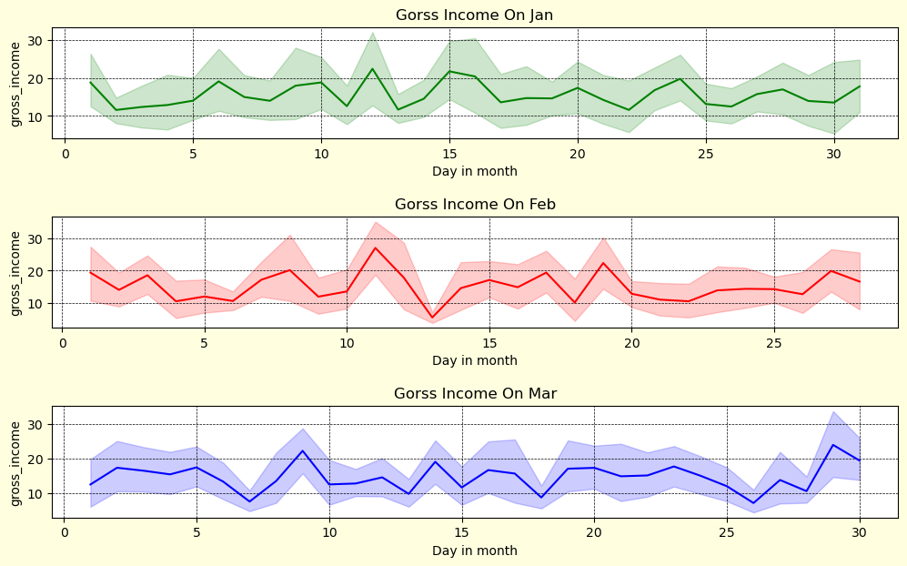
    


```python
super_market.head()
```


<div>
<style scoped>
    .dataframe tbody tr th:only-of-type {
        vertical-align: middle;
    }

    .dataframe tbody tr th {
        vertical-align: top;
    }

    .dataframe thead th {
        text-align: right;
    }
</style>
<table border="1" class="dataframe">
  <thead>
    <tr style="text-align: right;">
      <th></th>
      <th>Invoice_ID</th>
      <th>Branch</th>
      <th>City</th>
      <th>Customer_type</th>
      <th>Gender</th>
      <th>Product_line</th>
      <th>Unit_price</th>
      <th>Quantity</th>
      <th>Tax_5%</th>
      <th>Total</th>
      <th>Date</th>
      <th>Time</th>
      <th>Payment</th>
      <th>cogs</th>
      <th>gross_margin_percentage</th>
      <th>gross_income</th>
      <th>Rating</th>
    </tr>
  </thead>
  <tbody>
    <tr>
      <th>0</th>
      <td>750-67-8428</td>
      <td>A</td>
      <td>Yangon</td>
      <td>Member</td>
      <td>Female</td>
      <td>Health and beauty</td>
      <td>74.69</td>
      <td>7</td>
      <td>26.1415</td>
      <td>548.9715</td>
      <td>2019-01-05</td>
      <td>13:08:00</td>
      <td>Ewallet</td>
      <td>522.83</td>
      <td>4.761905</td>
      <td>26.1415</td>
      <td>9.1</td>
    </tr>
    <tr>
      <th>1</th>
      <td>226-31-3081</td>
      <td>C</td>
      <td>Naypyitaw</td>
      <td>Normal</td>
      <td>Female</td>
      <td>Electronic accessories</td>
      <td>15.28</td>
      <td>5</td>
      <td>3.8200</td>
      <td>80.2200</td>
      <td>2019-03-08</td>
      <td>10:29:00</td>
      <td>Cash</td>
      <td>76.40</td>
      <td>4.761905</td>
      <td>3.8200</td>
      <td>9.6</td>
    </tr>
    <tr>
      <th>2</th>
      <td>631-41-3108</td>
      <td>A</td>
      <td>Yangon</td>
      <td>Normal</td>
      <td>Male</td>
      <td>Home and lifestyle</td>
      <td>46.33</td>
      <td>7</td>
      <td>16.2155</td>
      <td>340.5255</td>
      <td>2019-03-03</td>
      <td>13:23:00</td>
      <td>Credit card</td>
      <td>324.31</td>
      <td>4.761905</td>
      <td>16.2155</td>
      <td>7.4</td>
    </tr>
    <tr>
      <th>3</th>
      <td>123-19-1176</td>
      <td>A</td>
      <td>Yangon</td>
      <td>Member</td>
      <td>Male</td>
      <td>Health and beauty</td>
      <td>58.22</td>
      <td>8</td>
      <td>23.2880</td>
      <td>489.0480</td>
      <td>2019-01-27</td>
      <td>20:33:00</td>
      <td>Ewallet</td>
      <td>465.76</td>
      <td>4.761905</td>
      <td>23.2880</td>
      <td>8.4</td>
    </tr>
    <tr>
      <th>4</th>
      <td>373-73-7910</td>
      <td>A</td>
      <td>Yangon</td>
      <td>Normal</td>
      <td>Male</td>
      <td>Sports and travel</td>
      <td>86.31</td>
      <td>7</td>
      <td>30.2085</td>
      <td>634.3785</td>
      <td>2019-02-08</td>
      <td>10:37:00</td>
      <td>Ewallet</td>
      <td>604.17</td>
      <td>4.761905</td>
      <td>30.2085</td>
      <td>5.3</td>
    </tr>
  </tbody>
</table>
</div>


```python
plt.figure(facecolor='grey')
sns.barplot(x=super_market['Quantity'],y=super_market['gross_income'])
plt.title('Gross Income Vs. Quantity',color='b')
```


    Text(0.5, 1.0, 'Gross Income Vs. Quantity')


    
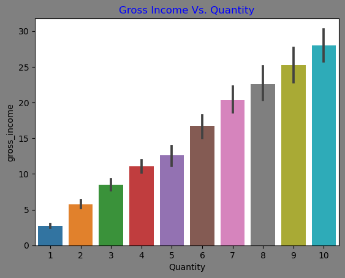
    


```python
plt.figure(facecolor='lightgrey')
sns.barplot(y=super_market['Unit_price'],x=super_market['Payment'])
plt.title('Unit price Vs. Payment Method',color='b')
```


    Text(0.5, 1.0, 'Unit price Vs. Payment Method')


    
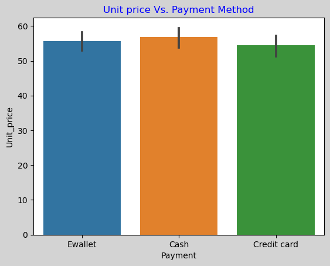
    


```python
plt.figure(figsize=(12,7),facecolor='lightgrey')
sns.barplot(y=super_market['Rating'],x=super_market['Product_line'],hue=super_market['Gender'])
plt.title('Product Line Vs. Rating')

```


    Text(0.5, 1.0, 'Product Line Vs. Rating')


    
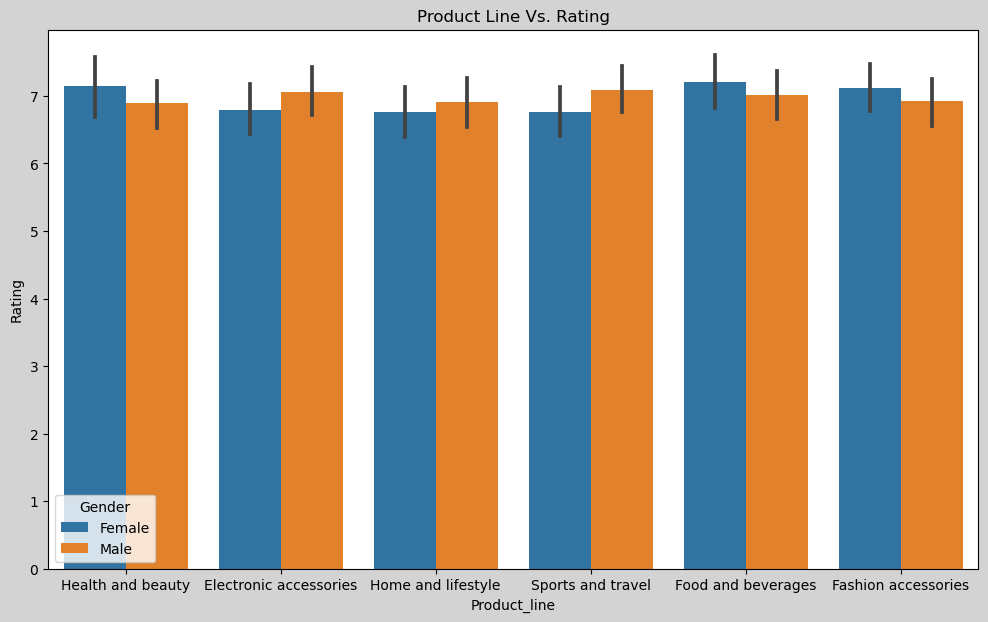
    


```python
plt.figure(figsize=(12,7),facecolor='lightgrey')
sns.barplot(y=super_market['Quantity'],x=super_market['Product_line'],hue=super_market['Gender'])
plt.title('Product Line Vs. Quantity')
```


    Text(0.5, 1.0, 'Product Line Vs. Quantity')


    
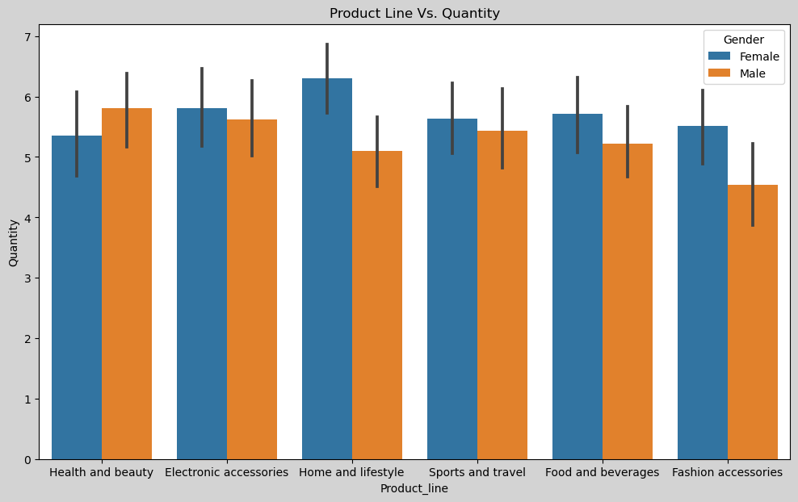
    


```python
plt.figure(figsize=(12,7),facecolor='lightgrey')
sns.kdeplot(y=super_market['Quantity'],x=super_market['Date'],color='r')
```


    <Axes: xlabel='Date', ylabel='Quantity'>


    
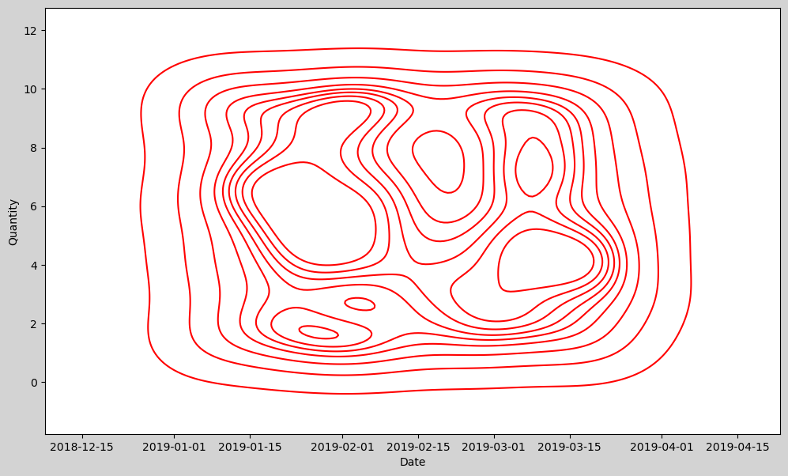
    


```python
plt.figure(figsize=(12,7),facecolor='lightgrey')
sns.boxplot(y=super_market['Quantity'],x=super_market['Gender'],hue=super_market['Product_line'],color='r')
```


    <Axes: xlabel='Gender', ylabel='Quantity'>


    

    


```python
plt.figure(facecolor='lightgrey')
sns.displot(data=super_market[['Quantity','Gender','Product_line','gross_income']],y='Product_line',x='Gender')
```

    /Users/jishnu.suneesh/anaconda3/lib/python3.11/site-packages/seaborn/axisgrid.py:118: UserWarning: The figure layout has changed to tight
      self._figure.tight_layout(*args, **kwargs)


    <seaborn.axisgrid.FacetGrid at 0x298a55310>


    <Figure size 640x480 with 0 Axes>


    
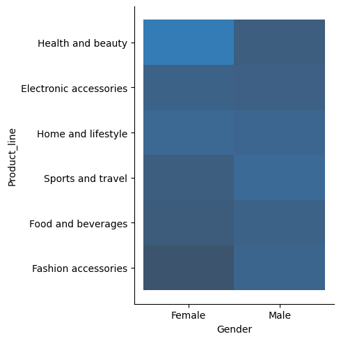
    


```python
plt.figure(facecolor='lightgrey')
sns.displot(data=super_market,x='Gender',y='Payment')
```

    /Users/jishnu.suneesh/anaconda3/lib/python3.11/site-packages/seaborn/axisgrid.py:118: UserWarning: The figure layout has changed to tight
      self._figure.tight_layout(*args, **kwargs)


    <seaborn.axisgrid.FacetGrid at 0x298bc2c50>


    <Figure size 640x480 with 0 Axes>


    

    


```python
plt.figure(figsize=(12,8),facecolor='lightyellow')

sns.lineplot(data=super_market,x='Date',y='gross_income',hue='Customer_type',ci=None)
```

    /var/folders/z_/5gwy872d0cj04k39nqbc17jw0000gq/T/ipykernel_98082/1998248511.py:3: FutureWarning: 
    
    The `ci` parameter is deprecated. Use `errorbar=None` for the same effect.
    
      sns.lineplot(data=super_market,x='Date',y='gross_income',hue='Customer_type',ci=None)


    <Axes: xlabel='Date', ylabel='gross_income'>


    

    


```python
plt.figure(figsize=(12,8),facecolor='lightyellow')

sns.barplot(data=super_market,x='Customer_type',y='gross_income',hue='Product_line',ci=None)
```

    /var/folders/z_/5gwy872d0cj04k39nqbc17jw0000gq/T/ipykernel_98082/1273320425.py:3: FutureWarning: 
    
    The `ci` parameter is deprecated. Use `errorbar=None` for the same effect.
    
      sns.barplot(data=super_market,x='Customer_type',y='gross_income',hue='Product_line',ci=None)


    <Axes: xlabel='Customer_type', ylabel='gross_income'>


    
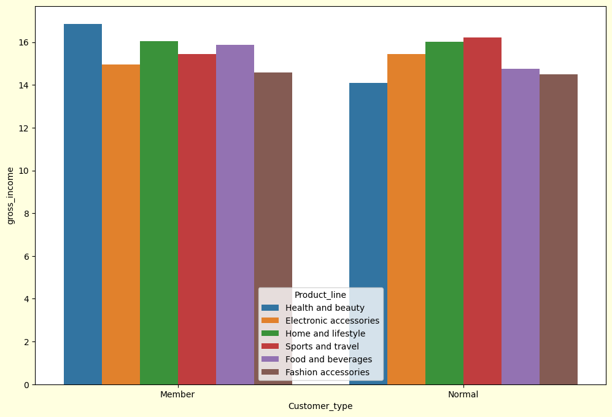
    


```python
super_market.info()
```

    <class 'pandas.core.frame.DataFrame'>
    RangeIndex: 1000 entries, 0 to 999
    Data columns (total 17 columns):
     #   Column                   Non-Null Count  Dtype         
    ---  ------                   --------------  -----         
     0   Invoice_ID               1000 non-null   object        
     1   Branch                   1000 non-null   object        
     2   City                     1000 non-null   object        
     3   Customer_type            1000 non-null   object        
     4   Gender                   1000 non-null   object        
     5   Product_line             1000 non-null   object        
     6   Unit_price               1000 non-null   float64       
     7   Quantity                 1000 non-null   int64         
     8   Tax_5%                   1000 non-null   float64       
     9   Total                    1000 non-null   float64       
     10  Date                     1000 non-null   datetime64[ns]
     11  Time                     1000 non-null   object        
     12  Payment                  1000 non-null   object        
     13  cogs                     1000 non-null   float64       
     14  gross_margin_percentage  1000 non-null   float64       
     15  gross_income             1000 non-null   float64       
     16  Rating                   1000 non-null   float64       
    dtypes: datetime64[ns](1), float64(7), int64(1), object(8)
    memory usage: 132.9+ KB


```python
super_market['City'].value_counts()
```


    City
    Yangon       340
    Mandalay     332
    Naypyitaw    328
    Name: count, dtype: int64


```python
plt.figure(figsize=(12,8),facecolor='lightyellow')

sns.barplot(data=super_market,x='City',y='gross_income',hue='Product_line',ci=None)
```

    /var/folders/z_/5gwy872d0cj04k39nqbc17jw0000gq/T/ipykernel_98082/1817538497.py:3: FutureWarning: 
    
    The `ci` parameter is deprecated. Use `errorbar=None` for the same effect.
    
      sns.barplot(data=super_market,x='City',y='gross_income',hue='Product_line',ci=None)


    <Axes: xlabel='City', ylabel='gross_income'>


    
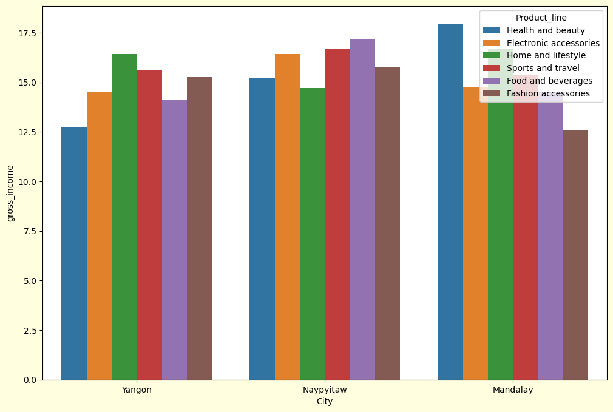
    


```python
super_market['Product_line'].value_counts()
```


    Product_line
    Fashion accessories       178
    Food and beverages        174
    Electronic accessories    170
    Sports and travel         166
    Home and lifestyle        160
    Health and beauty         152
    Name: count, dtype: int64


```python
plt.pie(super_market['Product_line'].value_counts(),autopct='%1.1f%%',labels=super_market['Product_line'].value_counts().index)
```


    ([<matplotlib.patches.Wedge at 0x29af992d0>,
      <matplotlib.patches.Wedge at 0x29af72f50>,
      <matplotlib.patches.Wedge at 0x29af6f990>,
      <matplotlib.patches.Wedge at 0x29af6efd0>,
      <matplotlib.patches.Wedge at 0x29aea8a10>,
      <matplotlib.patches.Wedge at 0x2991f6090>],
     [Text(0.9324457240113389, 0.583562311816802, 'Fashion accessories'),
      Text(-0.10351914875166028, 1.0951181606757017, 'Food and beverages'),
      Text(-1.0149400111567732, 0.4241423979668732, 'Electronic accessories'),
      Text(-0.8691705275003084, -0.6741977411151983, 'Sports and travel'),
      Text(0.12414196687386084, -1.0929724479879122, 'Home and lifestyle'),
      Text(0.9769500541254533, -0.5055379231514427, 'Health and beauty')],
     [Text(0.5086067585516393, 0.31830671553643736, '17.8%'),
      Text(-0.05646499022817833, 0.5973371785503827, '17.4%'),
      Text(-0.553603642449149, 0.2313503988910217, '17.0%'),
      Text(-0.4740930150001682, -0.3677442224264717, '16.6%'),
      Text(0.06771380011301499, -0.5961667898115883, '16.0%'),
      Text(0.5328818477047926, -0.2757479580826051, '15.2%')])


    
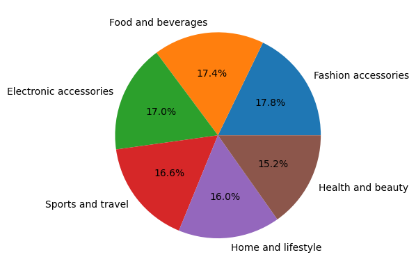
    


```python
plt.pie(super_market['City'].value_counts(),autopct='%1.1f%%',labels=super_market['City'].value_counts().index)
```


    ([<matplotlib.patches.Wedge at 0x29af6a650>,
      <matplotlib.patches.Wedge at 0x29af40bd0>,
      <matplotlib.patches.Wedge at 0x29af42650>],
     [Text(0.5299290306818474, 0.9639373540021144, 'Yangon'),
      Text(-1.099218420618879, -0.04145918200033682, 'Mandalay'),
      Text(0.5658834603115366, -0.9432793379194955, 'Naypyitaw')],
     [Text(0.28905219855373493, 0.5257840112738805, '34.0%'),
      Text(-0.599573683973934, -0.022614099272910988, '33.2%'),
      Text(0.3086637056244744, -0.514516002501543, '32.8%')])


    
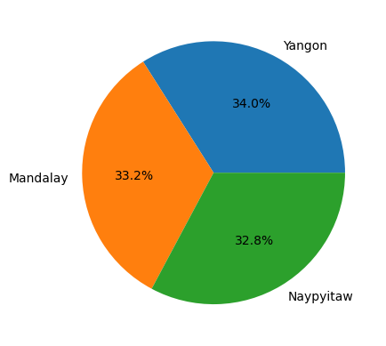
    

