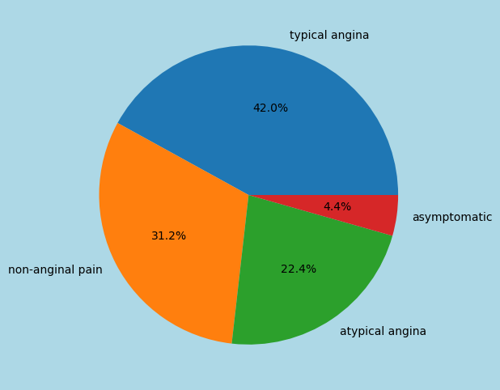
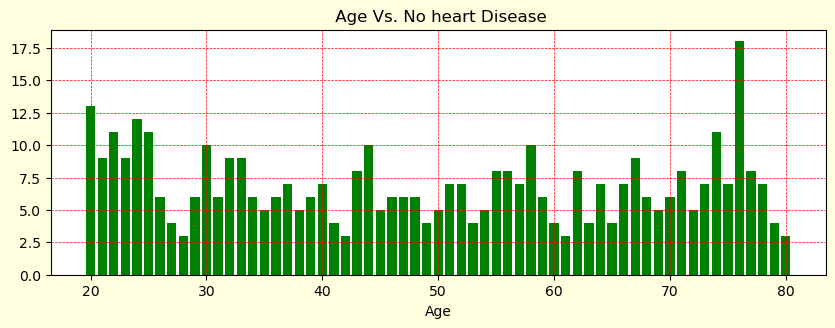
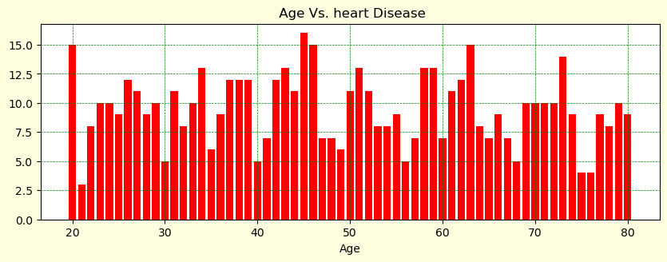
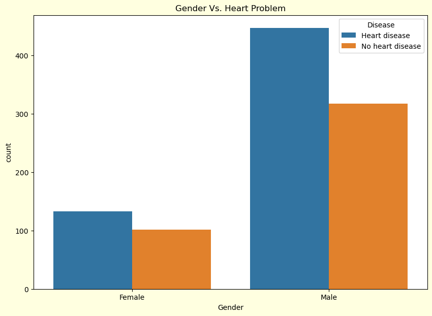
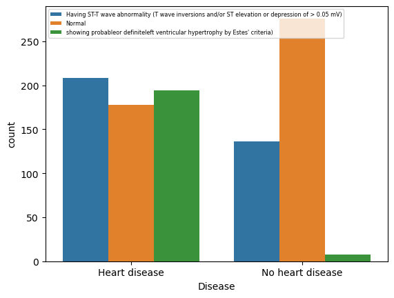
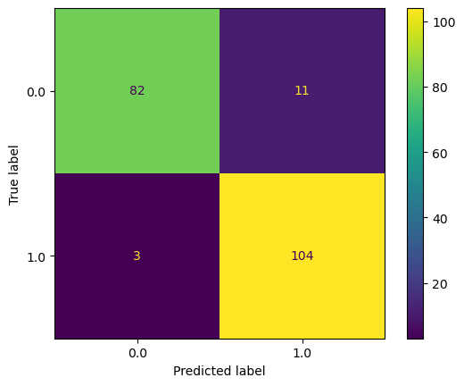

```python
import pandas as pd
import numpy as np
import matplotlib.pyplot as plt
```


```python
cardio=pd.read_csv('cardio_vascular_disease.csv',delimiter=',')
```


```python
cardio[:10]
```


<div>
<style scoped>
    .dataframe tbody tr th:only-of-type {
        vertical-align: middle;
    }

    .dataframe tbody tr th {
        vertical-align: top;
    }

    .dataframe thead th {
        text-align: right;
    }
</style>
<table border="1" class="dataframe">
  <thead>
    <tr style="text-align: right;">
      <th></th>
      <th>patientid</th>
      <th>age</th>
      <th>Gender</th>
      <th>Chestpain</th>
      <th>restingBP</th>
      <th>serumcholestrol</th>
      <th>fastingbloodsugar</th>
      <th>Restingrelectro</th>
      <th>maxheartrate</th>
      <th>Exerciseangia</th>
      <th>oldpeak</th>
      <th>Slope</th>
      <th>noofmajorvessels</th>
      <th>Disease</th>
    </tr>
  </thead>
  <tbody>
    <tr>
      <th>0</th>
      <td>103368.0</td>
      <td>53</td>
      <td>Male</td>
      <td>non-anginal pain</td>
      <td>171</td>
      <td>0</td>
      <td>0</td>
      <td>Having ST-T wave abnormality (T wave inversion...</td>
      <td>147</td>
      <td>No</td>
      <td>5</td>
      <td>downsloping</td>
      <td>3</td>
      <td>Heart disease</td>
    </tr>
    <tr>
      <th>1</th>
      <td>119250.0</td>
      <td>40</td>
      <td>Male</td>
      <td>typical angina</td>
      <td>94</td>
      <td>229</td>
      <td>0</td>
      <td>Having ST-T wave abnormality (T wave inversion...</td>
      <td>115</td>
      <td>No</td>
      <td>4</td>
      <td>upsloping</td>
      <td>1</td>
      <td>No heart disease</td>
    </tr>
    <tr>
      <th>2</th>
      <td>119372.0</td>
      <td>49</td>
      <td>Male</td>
      <td>non-anginal pain</td>
      <td>133</td>
      <td>142</td>
      <td>0</td>
      <td>Normal</td>
      <td>202</td>
      <td>Yes</td>
      <td>5</td>
      <td>upsloping</td>
      <td>0</td>
      <td>No heart disease</td>
    </tr>
    <tr>
      <th>3</th>
      <td>132514.0</td>
      <td>43</td>
      <td>Male</td>
      <td>typical angina</td>
      <td>138</td>
      <td>295</td>
      <td>1</td>
      <td>Having ST-T wave abnormality (T wave inversion...</td>
      <td>153</td>
      <td>No</td>
      <td>3</td>
      <td>flat</td>
      <td>2</td>
      <td>Heart disease</td>
    </tr>
    <tr>
      <th>4</th>
      <td>146211.0</td>
      <td>31</td>
      <td>Male</td>
      <td>atypical angina</td>
      <td>199</td>
      <td>0</td>
      <td>0</td>
      <td>showing probableor definiteleft ventricular hy...</td>
      <td>136</td>
      <td>No</td>
      <td>5</td>
      <td>downsloping</td>
      <td>2</td>
      <td>Heart disease</td>
    </tr>
    <tr>
      <th>5</th>
      <td>148462.0</td>
      <td>24</td>
      <td>Male</td>
      <td>atypical angina</td>
      <td>173</td>
      <td>0</td>
      <td>0</td>
      <td>Normal</td>
      <td>161</td>
      <td>No</td>
      <td>5</td>
      <td>downsloping</td>
      <td>2</td>
      <td>Heart disease</td>
    </tr>
    <tr>
      <th>6</th>
      <td>168686.0</td>
      <td>79</td>
      <td>Male</td>
      <td>non-anginal pain</td>
      <td>130</td>
      <td>240</td>
      <td>0</td>
      <td>showing probableor definiteleft ventricular hy...</td>
      <td>157</td>
      <td>No</td>
      <td>3</td>
      <td>flat</td>
      <td>1</td>
      <td>Heart disease</td>
    </tr>
    <tr>
      <th>7</th>
      <td>170498.0</td>
      <td>52</td>
      <td>Male</td>
      <td>typical angina</td>
      <td>127</td>
      <td>345</td>
      <td>0</td>
      <td>Normal</td>
      <td>192</td>
      <td>Yes</td>
      <td>5</td>
      <td>upsloping</td>
      <td>0</td>
      <td>No heart disease</td>
    </tr>
    <tr>
      <th>8</th>
      <td>188225.0</td>
      <td>62</td>
      <td>Male</td>
      <td>typical angina</td>
      <td>121</td>
      <td>357</td>
      <td>0</td>
      <td>Having ST-T wave abnormality (T wave inversion...</td>
      <td>138</td>
      <td>No</td>
      <td>3</td>
      <td>NaN</td>
      <td>0</td>
      <td>No heart disease</td>
    </tr>
    <tr>
      <th>9</th>
      <td>192523.0</td>
      <td>61</td>
      <td>Female</td>
      <td>typical angina</td>
      <td>190</td>
      <td>181</td>
      <td>0</td>
      <td>Having ST-T wave abnormality (T wave inversion...</td>
      <td>150</td>
      <td>No</td>
      <td>3</td>
      <td>flat</td>
      <td>0</td>
      <td>Heart disease</td>
    </tr>
  </tbody>
</table>
</div>


```python
cardio['Disease'].value_counts().index
```


    Index(['Heart disease', 'No heart disease'], dtype='object', name='Disease')


```python
plt.figure(figsize=(12,6),facecolor='lightblue')
plt.pie(cardio['Chestpain'].value_counts(),labels=cardio['Chestpain'].value_counts().index,autopct='%1.1f%%')
```


    ([<matplotlib.patches.Wedge at 0x165f93ad0>,
      <matplotlib.patches.Wedge at 0x165fb4d10>,
      <matplotlib.patches.Wedge at 0x165fb62d0>,
      <matplotlib.patches.Wedge at 0x165fb7910>],
     [Text(0.27355891977302554, 1.065441465972024, 'typical angina'),
      Text(-0.9769501251232583, -0.5055377859484395, 'non-anginal pain'),
      Text(0.6125631596598046, -0.9136555015034916, 'atypical angina'),
      Text(1.0895075683798439, -0.15156931893704584, 'asymptomatic')],
     [Text(0.14921395623983208, 0.5811498905301948, '42.0%'),
      Text(-0.5328818864308681, -0.2757478832446033, '31.2%'),
      Text(0.33412535981443886, -0.49835754627463175, '22.4%'),
      Text(0.5942768554799148, -0.08267417396566136, '4.4%')])


    

    


```python
cardio[['age','Disease']].value_counts()
```


    age  Disease         
    76   No heart disease    18
    45   Heart disease       16
    20   Heart disease       15
    46   Heart disease       15
    63   Heart disease       15
                             ..
    42   No heart disease     3
    28   No heart disease     3
    61   No heart disease     3
    21   Heart disease        3
    80   No heart disease     3
    Name: count, Length: 122, dtype: int64


```python
plt.figure(figsize=(10,7),facecolor='lightyellow')
ax=plt.subplot(2,1,1)
no_disease=cardio[cardio.Disease=='No heart disease']
plt.bar(no_disease['age'].value_counts().index,no_disease['age'].value_counts().values,color='g')
plt.grid(color='red',linestyle='--',linewidth=0.5)
plt.xlabel("Age")
plt.title(" Age Vs. No heart Disease")


diseased=cardio[cardio.Disease=='Heart disease']
plt.figure(figsize=(10,7),facecolor='lightyellow')
ax=plt.subplot(2,1,2)
plt.bar(diseased['age'].value_counts().index,diseased['age'].value_counts(),color='red')
plt.grid(color='green',linestyle='--',linewidth=0.5)
plt.xlabel("Age")
plt.title(" Age Vs. heart Disease")
```


    Text(0.5, 1.0, ' Age Vs. heart Disease')


    

    


    

    


```python
import seaborn as sns
plt.figure(figsize=(10,7),facecolor='lightyellow')
gender_based=cardio.groupby(['Gender','Disease']).agg(count=('Disease','count')).reset_index()
sns.barplot(x=gender_based['Gender'],y=gender_based['count'],hue=gender_based['Disease'])
plt.title('Gender Vs. Heart Problem')

```


    Text(0.5, 1.0, 'Gender Vs. Heart Problem')


    

    


```python
electro=cardio.groupby(['Restingrelectro','Disease']).agg(count=('Disease','count')).reset_index()
sns.barplot(x=electro['Disease'],y=electro['count'],hue=electro['Restingrelectro'])
plt.legend(loc=2,fontsize='xx-small')
```


    <matplotlib.legend.Legend at 0x28f3a8710>


    

    


```python
electro

```


```python
import tensorflow as tf
from sklearn.model_selection import train_test_split
from sklearn.preprocessing import OneHotEncoder
from sklearn.compose import make_column_transformer

```


```python
data=pd.read_csv('/Users/jishnu.suneesh/downloads/Cardiovascular_Disease_Dataset/Cardiovascular_Disease_Dataset.csv',delimiter=',')
data
```


```python
data[['age','gender','chestpain','restingBP',
                                                     'restingrelectro','maxheartrate','oldpeak','slope']].astype(np.float32)
```


<div>
<style scoped>
    .dataframe tbody tr th:only-of-type {
        vertical-align: middle;
    }

    .dataframe tbody tr th {
        vertical-align: top;
    }

    .dataframe thead th {
        text-align: right;
    }
</style>
<table border="1" class="dataframe">
  <thead>
    <tr style="text-align: right;">
      <th></th>
      <th>age</th>
      <th>gender</th>
      <th>chestpain</th>
      <th>restingBP</th>
      <th>restingrelectro</th>
      <th>maxheartrate</th>
      <th>oldpeak</th>
      <th>slope</th>
    </tr>
  </thead>
  <tbody>
    <tr>
      <th>0</th>
      <td>53.0</td>
      <td>1.0</td>
      <td>2.0</td>
      <td>171.0</td>
      <td>1.0</td>
      <td>147.0</td>
      <td>5.3</td>
      <td>3.0</td>
    </tr>
    <tr>
      <th>1</th>
      <td>40.0</td>
      <td>1.0</td>
      <td>0.0</td>
      <td>94.0</td>
      <td>1.0</td>
      <td>115.0</td>
      <td>3.7</td>
      <td>1.0</td>
    </tr>
    <tr>
      <th>2</th>
      <td>49.0</td>
      <td>1.0</td>
      <td>2.0</td>
      <td>133.0</td>
      <td>0.0</td>
      <td>202.0</td>
      <td>5.0</td>
      <td>1.0</td>
    </tr>
    <tr>
      <th>3</th>
      <td>43.0</td>
      <td>1.0</td>
      <td>0.0</td>
      <td>138.0</td>
      <td>1.0</td>
      <td>153.0</td>
      <td>3.2</td>
      <td>2.0</td>
    </tr>
    <tr>
      <th>4</th>
      <td>31.0</td>
      <td>1.0</td>
      <td>1.0</td>
      <td>199.0</td>
      <td>2.0</td>
      <td>136.0</td>
      <td>5.3</td>
      <td>3.0</td>
    </tr>
    <tr>
      <th>...</th>
      <td>...</td>
      <td>...</td>
      <td>...</td>
      <td>...</td>
      <td>...</td>
      <td>...</td>
      <td>...</td>
      <td>...</td>
    </tr>
    <tr>
      <th>995</th>
      <td>48.0</td>
      <td>1.0</td>
      <td>2.0</td>
      <td>139.0</td>
      <td>2.0</td>
      <td>183.0</td>
      <td>5.6</td>
      <td>2.0</td>
    </tr>
    <tr>
      <th>996</th>
      <td>47.0</td>
      <td>1.0</td>
      <td>3.0</td>
      <td>143.0</td>
      <td>1.0</td>
      <td>98.0</td>
      <td>5.7</td>
      <td>1.0</td>
    </tr>
    <tr>
      <th>997</th>
      <td>69.0</td>
      <td>1.0</td>
      <td>0.0</td>
      <td>156.0</td>
      <td>0.0</td>
      <td>196.0</td>
      <td>1.4</td>
      <td>3.0</td>
    </tr>
    <tr>
      <th>998</th>
      <td>45.0</td>
      <td>1.0</td>
      <td>1.0</td>
      <td>186.0</td>
      <td>1.0</td>
      <td>117.0</td>
      <td>5.9</td>
      <td>3.0</td>
    </tr>
    <tr>
      <th>999</th>
      <td>25.0</td>
      <td>1.0</td>
      <td>0.0</td>
      <td>158.0</td>
      <td>0.0</td>
      <td>143.0</td>
      <td>4.7</td>
      <td>0.0</td>
    </tr>
  </tbody>
</table>
<p>1000 rows × 8 columns</p>
</div>


```python
X_train,X_test,y_train,y_test=train_test_split(data[['age','gender','chestpain','restingBP',
                                                     'restingrelectro','maxheartrate','oldpeak','slope']].astype(np.float32),
                                               data['target'].astype(np.float32),test_size=0.2)
```


```python
X_test,y_test
```


    (      age  gender  chestpain  restingBP  restingrelectro  maxheartrate  \
     51   43.0     1.0        1.0      178.0              1.0         137.0   
     596  22.0     1.0        0.0      196.0              1.0         106.0   
     639  35.0     1.0        0.0      100.0              0.0         110.0   
     83   73.0     1.0        2.0      126.0              2.0         185.0   
     842  76.0     1.0        1.0      101.0              0.0         127.0   
     ..    ...     ...        ...        ...              ...           ...   
     312  41.0     1.0        0.0      137.0              0.0          98.0   
     524  34.0     1.0        3.0      195.0              0.0         142.0   
     295  67.0     0.0        0.0      138.0              1.0         148.0   
     889  78.0     0.0        1.0      191.0              0.0         127.0   
     231  55.0     1.0        2.0      142.0              0.0         196.0   
     
          oldpeak  slope  
     51       5.7    3.0  
     596      3.0    0.0  
     639      5.7    0.0  
     83       5.6    3.0  
     842      4.4    1.0  
     ..       ...    ...  
     312      1.1    0.0  
     524      5.3    2.0  
     295      1.0    1.0  
     889      1.2    3.0  
     231      0.2    0.0  
     
     [200 rows x 8 columns],
     51     1.0
     596    0.0
     639    0.0
     83     1.0
     842    0.0
           ... 
     312    0.0
     524    1.0
     295    0.0
     889    1.0
     231    0.0
     Name: target, Length: 200, dtype: float32)


```python
model_1=tf.keras.models.Sequential([
    tf.keras.layers.Input(shape=(8)),
    tf.keras.layers.Dense(100,activation="relu"),
    tf.keras.layers.Dense(1,activation="sigmoid")

])

model_1.compile(loss=tf.keras.losses.binary_crossentropy,
             optimizer=tf.keras.optimizers.Adam(),
             metrics=['accuracy']
             )

history=model_1.fit(X_train,y_train,epochs=100,verbose=0)
```

    WARNING:absl:At this time, the v2.11+ optimizer `tf.keras.optimizers.Adam` runs slowly on M1/M2 Macs, please use the legacy Keras optimizer instead, located at `tf.keras.optimizers.legacy.Adam`.


```python
model_1.evaluate(X_test)
```

    7/7 [==============================] - 0s 698us/step - loss: 0.0000e+00 - accuracy: 0.0000e+00


    [0.0, 0.0]


```python
hist=pd.DataFrame(history.history)
hist
```


<div>
<style scoped>
    .dataframe tbody tr th:only-of-type {
        vertical-align: middle;
    }

    .dataframe tbody tr th {
        vertical-align: top;
    }

    .dataframe thead th {
        text-align: right;
    }
</style>
<table border="1" class="dataframe">
  <thead>
    <tr style="text-align: right;">
      <th></th>
      <th>loss</th>
      <th>accuracy</th>
    </tr>
  </thead>
  <tbody>
    <tr>
      <th>0</th>
      <td>3.393533</td>
      <td>0.50375</td>
    </tr>
    <tr>
      <th>1</th>
      <td>1.060778</td>
      <td>0.60000</td>
    </tr>
    <tr>
      <th>2</th>
      <td>0.666153</td>
      <td>0.68375</td>
    </tr>
    <tr>
      <th>3</th>
      <td>0.530545</td>
      <td>0.75625</td>
    </tr>
    <tr>
      <th>4</th>
      <td>0.471400</td>
      <td>0.76875</td>
    </tr>
    <tr>
      <th>...</th>
      <td>...</td>
      <td>...</td>
    </tr>
    <tr>
      <th>95</th>
      <td>0.188400</td>
      <td>0.91875</td>
    </tr>
    <tr>
      <th>96</th>
      <td>0.170880</td>
      <td>0.94000</td>
    </tr>
    <tr>
      <th>97</th>
      <td>0.156741</td>
      <td>0.93500</td>
    </tr>
    <tr>
      <th>98</th>
      <td>0.147363</td>
      <td>0.94625</td>
    </tr>
    <tr>
      <th>99</th>
      <td>0.140826</td>
      <td>0.94250</td>
    </tr>
  </tbody>
</table>
<p>100 rows × 2 columns</p>
</div>


```python
y_pred=model_1.predict(X_test)

from sklearn.metrics import ConfusionMatrixDisplay

y_pred
y=np.array(y_pred)

for i in range(len(y_pred)):
    if y_pred[i]>0.5:
        y_pred[i]=1
    else:
        y_pred[i]=0

        
ConfusionMatrixDisplay.from_predictions(y_true=y_test,y_pred=y_pred)

```

    7/7 [==============================] - 0s 634us/step


    <sklearn.metrics._plot.confusion_matrix.ConfusionMatrixDisplay at 0x2af021e90>


    

    

